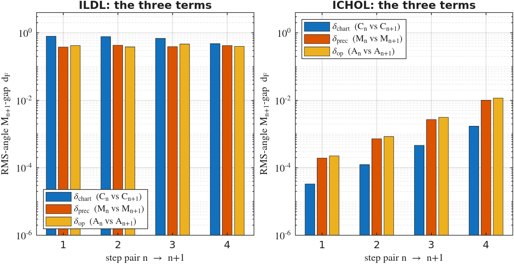
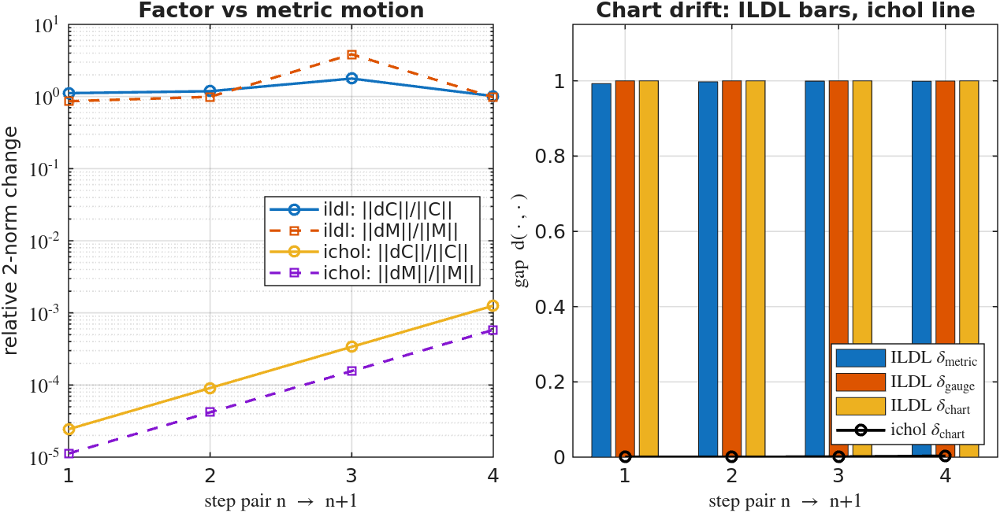
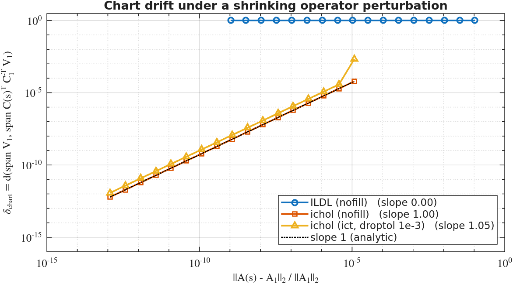
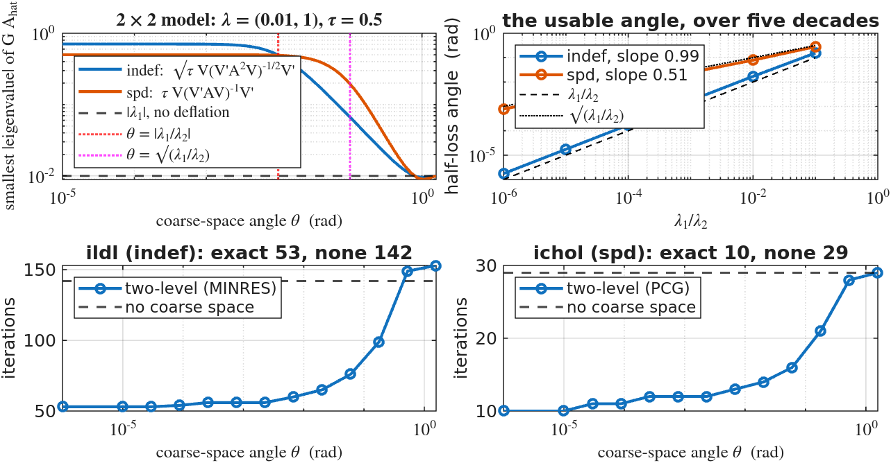
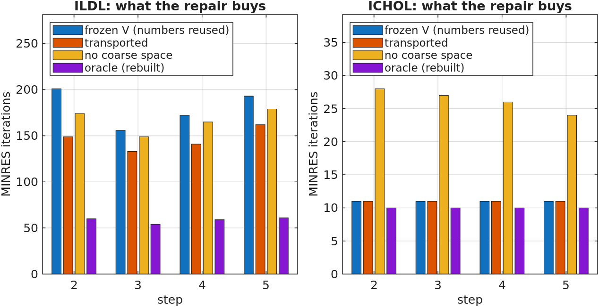

# Coordinate drift in preconditioned subspace recycling

Why a recycled deflation basis is destroyed when the ILDL factor is refreshed, why the
same thing barely happens with `ichol`, and why re-charting the cached subspace repairs it.

Every claim below is a statement about **subspaces**, and every one that can be tested
numerically has an experiment in `experiments/` that either confirms it or fails loudly.
`output/verdicts.csv` is the score: **59 PASS, 0 FAIL, 25 REPORT** at the settings quoted
throughout (`experiments/run_all.m`, ~40 s). A REPORT row is a measurement with no
pass/fail attached; one of them records a theorem that turns out to be *inapplicable* on
the family this study is about, which is a result in its own right (§2, Thm 2.3).

---

## Notation, and one standing requirement

| symbol | meaning |
|---|---|
| $A_n$ | step-$n$ system matrix: $\mathcal K_n$, the symmetric indefinite immersed-rotor KKT matrix, or an SPD kernel-ridge matrix |
| $C_n$ | preconditioner factor; $M_n = C_nC_n^{\top}$ is SPD, so $C_n$ is square and nonsingular |
| ILDL | $C_n = S_n^{-1}P_n^{\top}L_n\lvert D_n\rvert^{1/2}$ from `[L,D,p,S] = ldl(A,'vector')`, in MATLAB's convention $S A S = P L D L^{\top} P^{\top}$ |
| ichol | $C_n = L_n$ from `ichol(A,'nofill')` |
| $\hat A_n$ | $C_n^{-1}A_nC_n^{-\top}$, the split operator MINRES runs on; $\hat y = C_n^{\top}x$ |
| $\Phi_n$ | the **chart map** $\mathcal U \mapsto C_n^{\top}\mathcal U$ on the Grassmannian $\mathrm{Gr}(k,N)$ |
| $T_n$ | the **transport** $C_{n+1}^{\top}C_n^{-\top} = \Phi_{n+1}\circ\Phi_n^{-1}$ |
| $\mathcal U_k(A,M)$ | invariant subspace of the pencil $(A,M)$ for the $k$ smallest $\lvert\lambda\rvert$ — the physical deflation target |
| $\hat V,\ U$ | an **orthonormal** basis of the chart-side / physical-side space; results are stated for spans, but the formulas below are the span's formulas only in an orthonormal basis |
| $G$ | the coarse correction actually applied. **It is not the same operator in the two families** — see below |
| $G_{\rm spd}$ | $(I-\Pi)+\tau\,\hat V(\hat V^{\top}\hat A\hat V)^{-1}\hat V^{\top}$, built on $\hat A$; the `ichol` column, run by PCG |
| $G_{\rm ind}$ | $(I-\Pi)+\sqrt{\tau}\,\hat V(\hat V^{\top}\hat A^{2}\hat V)^{-1/2}\hat V^{\top}$, built on $\hat A^{2}$; the `ildl` column, run by MINRES |
| $\tau,\,k,\,n_C$ | coarse weight (0.5); coarse dimension; number of coupling rows |

**The coarse correction is part of the family.** $\hat V^{\top}\hat A\hat V$ has no definite sign
when $\hat A$ is indefinite, so the coarse solve breaks; squaring the operator restores
definiteness, and the half power then undoes the squaring's effect on the scale, since
$(\hat V^{\top}\hat A^{2}\hat V)^{-1/2}\to\lvert\Lambda\rvert^{-1}$ on an invariant span. When
$\hat A$ is already SPD none of that is needed, and §4.1 measures what it costs to do it anyway.
Captured modes land on $\tau$ under $G_{\rm spd}$ and on $\pm\sqrt{\tau}$ under $G_{\rm ind}$, and
the two families are solved by different Krylov methods, so **iteration counts below are
comparable within a column and not across**. `kernel/coarse_correction.m`,
`kernel/two_level_solve_local.m`.

**Standing assumption.** $\lvert\lambda_k\rvert<\lvert\lambda_{k+1}\rvert$ strictly, for every
pencil named below. Otherwise "the $k$ smallest $\lvert\lambda\rvert$" is not a spectral set
and $\mathcal U_k(A,M)$ is not defined. All subspaces compared anywhere in this document have
the same dimension $k$; the distances below are metrics on $\mathrm{Gr}(k,N)$ and the
identities defining them fail for unequal dimensions.

**Distances.** Only two, both defined through projectors and therefore blind to the choice
of basis:

```math
d_M(\mathcal X,\mathcal Y)=\bigl\lVert \Pi^{M}_{\mathcal X}-\Pi^{M}_{\mathcal Y}\bigr\rVert_{M}=\sin\theta^{M}_{\max},
\qquad
d_F(\mathcal X,\mathcal Y)=\frac{\lVert \Pi_{\mathcal X}-\Pi_{\mathcal Y}\rVert_F}{\sqrt{2k}}=\sqrt{\tfrac1k\textstyle\sum_i \sin^2\theta_i}.
```

$M = I$ gives the Euclidean gap $d$. Both are metrics on $\mathrm{Gr}(k,N)$, so the triangle
inequality of Thm 2.1 is available. $d$ saturates — one lost direction out of $k$ already
gives $1$ — so $d_F$, the root-mean-square principal angle, is reported alongside it
everywhere. `kernel/gap.m`, `kernel/gap_M.m`.

**The standing requirement.** Deflation depends on $\hat V$ only through the projector onto
its span (Thm 1.3), so this analysis does too. Bases appear inside proofs, never in a
statement. Two quantities are deliberately *not* invariant — the factor-dependent bound in
Lemma 2.2 and $\delta_{\mathrm{gauge}}$ in §2.1 — and that non-invariance is the phenomenon
being described, not an oversight.

---

## 1. The chart is a choice of inner product

**Theorem 1.1 (pencil $\leftrightarrow$ split operator).**
$A u=\lambda M u \iff \hat A\,(C^{\top}u)=\lambda\,(C^{\top}u)$.

*Proof.* $\hat A C^{\top}u = C^{-1}Au = \lambda C^{-1}Mu = \lambda C^{-1}CC^{\top}u = \lambda C^{\top}u$;
$C^{\top}$ is a bijection because $M$ is SPD, which gives the converse. $\square$

So $\Phi_C$ maps pencil invariant subspaces of $(A,M)$ bijectively to invariant subspaces of
$\hat A$, and $\hat A = C^{\top}(M^{-1}A)C^{-\top}$ is similar to $M^{-1}A$.
Measured: $d(\Phi_C\mathcal U_k,\ \hat A\,\Phi_C\mathcal U_k) = 1.2\cdot10^{-13}$ (ILDL),
$1.5\cdot10^{-11}$ (ichol), with eigenvalues preserved to $10^{-15}$ relative.

**Theorem 1.2 (isometry).** $\langle C^{\top}u,C^{\top}v\rangle_2=\langle u,v\rangle_M$, hence
for all $\mathcal X,\mathcal Y\in\mathrm{Gr}(k,N)$

```math
d\bigl(\Phi_C\mathcal X,\ \Phi_C\mathcal Y\bigr)\;=\;d_M(\mathcal X,\mathcal Y).
```

*Proof.* $C^{\top}$ carries the $M$-inner product to the Euclidean one, so
$C^{\top}\Pi^{M}_{\mathcal X}C^{-\top}=\Pi_{C^{\top}\mathcal X}$ and
$\lVert Z\rVert_M=\lVert C^{\top}ZC^{-\top}\rVert_2$; every principal angle is preserved. $\square$

This is the sentence the whole document turns on: **the preconditioner does not relabel
coordinates, it selects the inner product** in which orthogonality, angle, and therefore
deflation are measured. Refreshing $C$ changes the geometry on an unchanged vector space.
Verified by two disjoint code paths — `gap_M` never forms $C$, `gap` never forms $M$ — and
they agree to $3\cdot10^{-16}$ (ILDL) and $1\cdot10^{-16}$ (ichol).

**Theorem 1.3 (the method is a function on the Grassmannian).** For $\hat V$ with
orthonormal columns, $G$ — and hence the spectrum of $G\hat A$ — is unchanged under
$\hat V\mapsto\hat VQ$ for every $Q\in O(k)$. Since any two orthonormal bases of a subspace
differ by such a $Q$, $G$ is a well-defined function of $\mathrm{span}\,\hat V$ alone.
**This holds in both forms**, with the same proof at $p=1$ and $p=\tfrac12$.

*Proof.* $(Q^{\top}\hat EQ)^{-p}=Q^{\top}\hat E^{-p}Q$, so
$\hat VQ(Q^{\top}\hat EQ)^{-p}Q^{\top}\hat V^{\top}=\hat V\hat E^{-p}\hat V^{\top}$;
and $\hat VQQ^{\top}\hat V^{\top}=\hat V\hat V^{\top}=\Pi$. Take
$\hat E=\hat V^{\top}\hat A\hat V,\ p=1$ for $G_{\rm spd}$ and
$\hat E=\hat V^{\top}\hat A^{2}\hat V,\ p=\tfrac12$ for $G_{\rm ind}$. $\square$

**Orthonormality is not a formality here.** For a general change of basis $\hat V\mapsto\hat VR$,
$R(R^{\top}\hat ER)^{-1/2}R^{\top}=\hat E^{-1/2}$ holds *iff* $R$ is orthogonal. Take
$\hat A=I$, $\hat V=[e_1,e_2]$, $R=\mathrm{diag}(2,1)$: the coarse term becomes
$2e_1e_1^{\top}+e_2e_2^{\top}$ instead of $e_1e_1^{\top}+e_2e_2^{\top}$. This is why
`orth_trunc` is called before every use of a basis in `kernel/`, and why §5 cannot treat the
raw transported block $C_{n+1}^{\top}U_n$ as interchangeable with an orthonormal basis of its
span.

**Theorem 1.4 (gauge covariance).** The factor is not determined by $M$: for square
nonsingular $C_0$, $\{C:CC^{\top}=M\}=\{C_0Q:Q\in O(N)\}$, so the fibre over $M$ is exactly
one $O(N)$ orbit. Under $C\mapsto CQ$ one has $\hat A\mapsto Q^{\top}\hat AQ$,
$\hat V\mapsto Q^{\top}\hat V$, $\hat b\mapsto Q^{\top}\hat b$, and the method is unchanged
**provided operator, basis, right-hand side and initial guess are regauged together**.
Freezing $\hat V$ while $C$ is refreshed regauges everything except the basis.

That last sentence is the entire bug, and Thm 1.3 is why it cannot be waved away as "just a
different basis": $O(k)$ acts *inside* the span and is invisible; $O(N)$ acts on the chart and
moves the span. The experiment separates the two exactly (`exp1`, iteration counts):

| | consistent regauge $(C\!\to\!CQ,\ \hat V\!\to\!Q^{\top}\hat V)$ | frozen $\hat V$, same $CQ$ |
|---|---|---|
| ILDL | 54 → **55** | 54 → **159** |
| ichol | 10 → **10** | 10 → **31** |

The identity behind the first column is exact; the single ILDL iteration of difference is
roundoff, since an integer iteration count is a discontinuous function of a residual norm.
Thm 1.3 is therefore tested at the operator level as well —
$\lVert G(\hat V)Z-G(\hat VQ)Z\rVert/\lVert Z\rVert$ against a tolerance of
$10^{-12}\kappa(\hat E)$. Measured $1.2\cdot10^{-13}$ at $\kappa(\hat E)=2.3\cdot10^{3}$ (ILDL)
and $8.5\cdot10^{-9}$ at $\kappa(\hat E)=1.3\cdot10^{4}$ (ichol).

**The squaring is visible here, and it is expensive.** For ILDL, $\hat E=\hat V^{\top}\hat A^{2}\hat V$
is ill-conditioned *by construction* — squaring squares the condition number — and the tolerance
has to say so. The SPD family has no such obligation: with $\hat E=\hat V^{\top}\hat A\hat V$ the
same measurement gives $\kappa(\hat E)=1.3\cdot10^{4}$ against $1.7\cdot10^{8}$ for the squared
form on the same problem, and the invariance error falls from $3.2\cdot10^{-5}$ to
$8.5\cdot10^{-9}$ — four decades of conditioning and nearly four of accuracy, recovered by not
squaring an operator that was already definite. (`exp1`. The $3.2\cdot10^{-5}$ figure is what an
earlier version of this study measured, when both families were run through $G_{\rm ind}$.)

---

## 2. Separating the $C$ effect from the $A$ effect

Four subspaces, compared physically under the step-$(n{+}1)$ metric — equivalently, by
Thm 1.2, in the step-$(n{+}1)$ chart:

```math
\mathcal F=C_{n+1}^{-\top}\,\mathrm{span}\,\hat V_n,\quad
\mathcal U_n=\mathcal U_k(A_n,M_n),\quad
\mathcal U_n'=\mathcal U_k(A_n,M_{n+1}),\quad
\mathcal U_{n+1}=\mathcal U_k(A_{n+1},M_{n+1}).
```

**Theorem 2.1 (three-term decomposition).**

```math
d_{M_{n+1}}(\mathcal F,\mathcal U_{n+1})\;\le\;
\underbrace{d_{M_{n+1}}(\mathcal F,\mathcal U_n)}_{\delta_{\rm chart}\;:\;C_n\ \text{vs}\ C_{n+1}}
+\underbrace{d_{M_{n+1}}(\mathcal U_n,\mathcal U_n')}_{\delta_{\rm prec}\;:\;M_n\ \text{vs}\ M_{n+1}}
+\underbrace{d_{M_{n+1}}(\mathcal U_n',\mathcal U_{n+1})}_{\delta_{\rm op}\;:\;A_n\ \text{vs}\ A_{n+1}},
```

together with the reverse bound $\;\ge\delta_{\rm chart}-\delta_{\rm prec}-\delta_{\rm op}$.
Both are the triangle inequality for the metric $d_{M_{n+1}}$.

This is the requested separation, and it is worth being blunt about what it does and does not
buy. $\delta_{\rm chart}$ is the pure factor effect, with the operator *and* the physical
target both held fixed; $\delta_{\rm op}$ is the pure operator effect, with the metric held
fixed; $\delta_{\rm prec}$ is the cross term in which a changed preconditioner moves the
target itself rather than only its coordinates. **The value is in the three terms being
measured separately, not in the inequality.** On the ichol family both directions are tight.
On the ILDL family every term saturates, so at step 1 the forward bound reads
$1\le2.9986$ and the reverse bound reads $\ge-1.0$, and since $d\le1$ always, neither
carries information; in $d_F$ it is $0.793\le1.592$ and $\ge-0.006$. The decomposition is
honest bookkeeping there, and the evidence is the three separate numbers.

**Lemma 2.2 (bounding the chart term).** Let $\hat V_n$ have orthonormal columns with
$\mathrm{span}\,\hat V_n=C_n^{\top}\mathcal U_n$. Then in the chart
$\delta_{\rm chart}=d(\mathrm{span}\,\hat V_n,\ T_n\,\mathrm{span}\,\hat V_n)$ and

```math
\delta_{\rm chart}\;\le\;\lVert (I-T_n)\hat V_n\rVert_2\;\le\;\kappa_2(C_n)\,\frac{\lVert C_{n+1}-C_n\rVert_2}{\lVert C_n\rVert_2}.
```

*Proof.* $(I-\Pi_{T\mathcal S})T\hat V=0$, so $(I-\Pi_{T\mathcal S})\hat V=(I-\Pi_{T\mathcal S})(I-T)\hat V$;
take norms, using $\lVert\hat V_n\rVert_2=1$ for the first bound and
$I-T_n=-\Delta C^{\top}C_n^{-\top}$ for the second. $\square$ The left side is basis-free; the
right side is not, and §2.1 turns that into a theorem. Note the direction: this is an
**upper** bound on $\delta_{\rm chart}$, and §3 leans on that being all it is.

**Theorem 2.3 (Davis–Kahan for $\delta_{\rm op}$).** $\mathcal U_n'$ and $\mathcal U_{n+1}$ are
pencil subspaces of the *same* metric, so by Thm 1.2 the comparison transports to chart
$n{+}1$, where both are invariant subspaces of symmetric matrices differing by
$E=C_{n+1}^{-1}\,\Delta A\,C_{n+1}^{-\top}$. The $k$ smallest-$\lvert\lambda\rvert$ set is
$\mathrm{spec}\cap[-\lvert\lambda_k\rvert,\lvert\lambda_k\rvert]$.

**Which $\sin\Theta$ theorem applies depends on the family.** For the indefinite family that set
straddles the origin: it is a *middle* spectral set — a consecutive block in the **signed** order,
but not an extremal one — so the applicable statement is the two-sided $\sin\Theta$ theorem.
For the SPD family $\hat A\succ0$, so the $k$ smallest $\lvert\lambda\rvert$ *are* the $k$
smallest $\lambda$: an **extremal** set, and the ordinary one-sided Davis–Kahan applies. Either
way the separation is the same number, $\gamma=\lvert\lambda_{k+1}\rvert-\lvert\lambda_k\rvert$,
and so is the bound below; only the theorem being cited changes. (An earlier version of this
document claimed the two-sided form for both columns, which is wrong for the SPD one — harmlessly,
since the bound is identical, but it is the wrong reason.) Reading $\gamma$ off the perturbed
operator $\hat A_{n+1}$ then costs Weyl's correction:

```math
\delta_{\rm op}\;\le\;\frac{\lVert E\rVert_2}{\gamma-\lVert E\rVert_2},\qquad\text{provided }\gamma>\lVert E\rVert_2 .
```

The uncorrected $\lVert E\rVert_2/\gamma$ — the form an earlier draft of this document and of
`exp2` used — is **false**. Take $C_{n+1}=I$, $k=1$, $N=3$,
$A_n=\mathrm{diag}(-5,1,1+\rho)$ with $\rho\downarrow0$ and
$E=\eta(e_2e_3^{\top}+e_3e_2^{\top})$. Then $\mathcal U_1(A_n)=\mathrm{span}\{e_2\}$,
$\mathcal U_1(A_{n+1})=\mathrm{span}\{(e_2-e_3)/\sqrt2\}$, so $\delta_{\rm op}=\sin45^\circ=0.7071$,
while $\lVert E\rVert=\eta$ and $\gamma=(1+\eta)-(1-\eta)=2\eta$: the uncorrected bound claims
$0.5$. The corrected one gives $\eta/\eta=1$.

**Measured, the corrected theorem is inapplicable on the family this study is about.**
$\gamma>\lVert E\rVert$ holds at 2 of 4 ichol pairs (bounds $0.126$ and $0.713$ against
$\delta_{\rm op}=1.2\cdot10^{-3}$ and $4.6\cdot10^{-3}$) and at **no** ILDL pair, where the
median $\lVert E\rVert/\gamma$ is $1.0\cdot10^{4}$. One rotor step perturbs the split
operator four decades more than the spectral gap it would have to respect, so Davis–Kahan
says nothing there. That is recorded as a REPORT row, not a PASS. Separately, and
independently of the bound, $\Delta A$ has rank exactly $2n_C$ — measured 32/32 at every
step — so by Weyl's inequalities for a rank-$r$ perturbation,
$\lambda_{i+r}(A+E)\le\lambda_i(A)$, eigenvalues move by at most $2n_C$ places in the
**signed** ordering. (That is a structural fact about $\Delta A$; it is not an ingredient of
the $\sin\Theta$ bound.)



*The three terms of Thm 2.1, measured separately, on a shared axis. At one full rotor step
all three ILDL terms are of the same order; the ichol terms are one to four decades smaller
and grow smoothly with the step. The 2-norm gap saturates at $1.000$ for every ILDL entry,
which is why $d_F$ is plotted.* (`exp2`; triangle inequality and reverse bound hold at
every step, both families.)

**A caveat that applies to every ILDL-vs-ichol number in this document.** The two families
are different problems perturbed by very different amounts: one rotor step moves the KKT
matrix by $\lVert\Delta A\rVert/\lVert A\rVert\approx0.11$, while one step of the kernel-ridge
ladder moves it by $1.2\cdot10^{-5}$ to $6.1\cdot10^{-4}$ (`output/exp3_pairs_*.csv`). Raw
side-by-side term sizes therefore confound preconditioner, problem and step size. The one
perturbation-matched comparison in this study is the *slope* measurement of §3, and that is
the comparison the conclusions rest on.

### 2.1 The chart term splits again: metric and gauge

Write $C_{n+1}=\tilde C_{n+1}Q_n$ with $Q_n\in O(N)$ the Procrustes-optimal alignment to $C_n$,
so that $\tilde C_{n+1}$ is the factor of $M_{n+1}$ sitting in $C_n$'s gauge. With
$\mathcal W = \tilde C_{n+1}^{\top}C_n^{-\top}\,\mathrm{span}\,\hat V_n$,

```math
\delta_{\rm chart}\;\le\;\underbrace{d(\mathrm{span}\,\hat V_n,\ \mathcal W)}_{\delta_{\rm metric}}
+\underbrace{d(\mathcal W,\ Q_n^{\top}\mathcal W)}_{\delta_{\rm gauge}} .
```

Like Thm 2.1 this is diagnostic rather than binding: on the real ILDL pairs
$\delta_{\rm metric}\approx0.999$ and $\delta_{\rm gauge}\approx1.000$, so the bound reads
$\delta_{\rm chart}\le2$ and is vacuous. What the split is for is the controlled experiment
below, where one of the two terms is driven to zero by construction.

**Proposition 2.4 (a perfect preconditioner still breaks a frozen basis).** If
$M_{n+1}=M_n$ *exactly* but $C_{n+1}=C_nQ$ with $Q\ne I$, then $\delta_{\rm metric}=0$ and
$\delta_{\rm chart}=\delta_{\rm gauge}$ exactly.

*Proof.* $C_n^{\top}C_{n+1}=C_n^{\top}C_nQ$; writing $C_n^{\top}C_n=U\Lambda U^{\top}$, this
is $U\Lambda(Q^{\top}U)^{\top}$, an SVD, so the Procrustes minimiser is $UU^{\top}Q=Q$ and
$\tilde C_{n+1}=C_{n+1}Q^{\top}=C_n$. Hence $\tilde T=I$,
$\mathcal W=\mathrm{span}\,\hat V_n$ and $\delta_{\rm metric}=0$; while $T=C_{n+1}^{\top}C_n^{-\top}=Q^{\top}$,
so $\delta_{\rm chart}=d(\mathrm{span}\,\hat V_n,\ Q^{\top}\mathrm{span}\,\hat V_n)=\delta_{\rm gauge}$. $\square$

How large is $\delta_{\rm gauge}$? For Haar-distributed $Q$ it is $\Theta(1)$ and the constant
is computable: $d_F^{2}=1-\tfrac1k\mathrm{tr}(\Pi_{\mathcal S}\Pi_{Q\mathcal S})$ and
$\mathbb E[\Pi_{Q\mathcal S}]=(k/N)I$, so $\mathbb E\,d_F^{2}=1-k/N$, i.e. $d_F\approx0.966$ at
$k=50$, $N=760$. (The measured 2-norm $1.000$ is $1-O(k/N)$ rounded; $\sin\theta_{\max}=1$
*exactly* is not generic.)

This is the sharpest form of the failure, because it holds every competing explanation at
zero. `exp3A` runs it with $\lVert M_2-M_1\rVert/\lVert M_1\rVert = 3.5\cdot10^{-16}$:

| | $\delta_{\rm metric}$ | $\delta_{\rm gauge}$ | its: reference \| frozen \| transported \| no coarse space |
|---|---|---|---|
| ILDL | $1.2\cdot10^{-11}$ | $1.000$ | 54 \| **161** \| 55 \| 146 |
| ichol | $4.3\cdot10^{-15}$ | $1.000$ | 10 \| **30** \| 10 \| 29 |

Nothing about the preconditioner changed. A frozen coarse space nonetheless costs 161
iterations against 146 for **no coarse space at all**, and transport restores the reference
count exactly. The culprit is the factor, not the preconditioner.



*Left: the relative motion of the factor and of the metric it defines, per step. Right: the
chart term and its metric/gauge split. Under ILDL both parts saturate; under ichol both are
$O(\lVert\Delta A\rVert)$.*

A prediction worth recording as refuted: the ILDL drift is **not predominantly a regauge**.
A Procrustes alignment removes only about 20 % of the factor motion, and the metric moves by
$O(1)$ as well. Prop 2.4 is decisive because a regauge alone *suffices* to destroy a frozen
basis — not because it is the only thing happening.

---

## 3. Why $\delta_{\rm chart}$ is $\Theta(1)$ along the rotor sequence and $O(\lVert\Delta A\rVert)$ for ichol

**Theorem 3.1 (ichol is real-analytic).** Fix a lower-triangular pattern
$\mathcal S\supseteq\mathrm{diag}$, **chosen independently of $A$**. The IC(0) conditions
$(LL^{\top})_{ij}=A_{ij}$ on $\mathcal S$, $L_{ij}=0$ off it, $L_{ii}>0$ determine
$A\mapsto L$, and that map is real-analytic wherever it exists. Hence
$\lVert\Delta C\rVert\le\gamma_L\lVert\Delta A\rVert+O(\lVert\Delta A\rVert^{2})$ and, by
Lemma 2.2 — used here in the direction it actually runs — $\delta_{\rm chart}\to0$ with the
step. (Proof in A.1.)

The gauge is pinned by the fixed pattern and the sign convention $L_{ii}>0$, so Prop 2.4's
mechanism has no room to act. **The independence of $\mathcal S$ from $A$ carries the
theorem**, and it is a real hypothesis, not a formality: `ichol(A,'nofill')` takes
$\mathcal S=\mathrm{tril}(\mathrm{pattern}(A))$, which is constant here only because the SPD
family is perturbed by a diagonal shift on a pre-thresholded pattern
(`kernel/make_case.m`). An SPD sequence whose sparsity pattern moved would not satisfy
Thm 3.1 either. Note also that $\gamma_L$ is local and can be large — the theorem gives
continuity, not smallness.

**Theorem 3.2 (ILDL is only piecewise-analytic).** $C_n$ factors through three combinatorial
maps, each locally constant on an open set and jumping across a switching set:

1. the AMD ordering, a function of $\mathrm{pattern}(A)$ alone;
2. the MC64-style matching that produces the scaling $S$;
3. a threshold pivot test choosing between $1\times1$ and $2\times2$ pivots.

On each cell $C$ is analytic; across a boundary it can jump by $\Theta(1)$, and generically
does. Hence $A\mapsto C$ has **no modulus of continuity at any $A$ lying on a switching set**.

That conclusion is weaker than it first looks, and the honest consequence is stronger. Two
things it does *not* say:

- **It says nothing about a step that stays inside a cell.** Obs 3.4 measures exactly that
  case on the real KKT matrix and finds log-log slope $0.96$: for value-only perturbations
  that leave $\mathrm{pattern}(A)$ alone, ILDL is first order in the step, just like ichol.
- **Lemma 2.2 runs the wrong way.** It bounds $\delta_{\rm chart}$ *above* by $\lVert\Delta C\rVert$,
  so a large $\lVert\Delta C\rVert$ implies nothing about the subspace. $C_{n+1}=-C_n$ has
  $\lVert\Delta C\rVert/\lVert C\rVert=2$ and $T_n=-I$, which fixes every subspace:
  $\delta_{\rm chart}=0$. Neither Lemma 2.2 nor the reverse bound of Thm 2.1 can convert
  factor motion into subspace motion.

What holds at every rotor step is a fact about *where $A_n$ sits*, not about how far it
moves: Lagrange points cross triangle edges, so $\mathrm{pattern}(A_n)$ changes, so $A_n$ is
**on** the switching set of map 1 at every single step — never in the interior of a cell.
For the AMD map the sparse matrices of interest live on the low-dimensional stratum, so
"locally constant on an open dense set" is cold comfort. That $\delta_{\rm chart}$ is then
$\Theta(1)$ is the *measurement* of exp4 and exp5, not a corollary of Thm 3.2.



*The headline measurement. Interpolate toward the next step, $A(s)=A_1+s(A_2-A_1)$, rebuild
the factor at each $s$, hold the physical subspace fixed, and plot the chart term against
$\lVert\Delta A\rVert/\lVert A\rVert$. ILDL: slope $0.00$, pinned at $\delta_{\rm chart}=1$
across nine decades — every $s>0$ already carries $A_2$'s pattern, so the path leaves the
cell immediately. ichol: slope $1.00$ (`nofill`) and $1.05$ (`ict`, droptol $10^{-3}$),
tracking the analytic reference. At a matched $\lVert\Delta A\rVert/\lVert A\rVert\approx10^{-5}$
the two differ by a factor $1.6\cdot10^{4}$.* (`exp4`.)

A value-dependent *drop pattern* is not the same hazard as reordering: dropping an entry
below the tolerance perturbs $C$ by $O(\text{droptol})$, whereas reordering permutes it. That
is why the `ict` curve still has slope 1.

**Proposition 3.3 (an explicit jump).** For the dense Bunch–Kaufman rule with
$\alpha=(1+\sqrt{17})/8$, the family below takes a $1\times1$ pivot exactly when
$\varepsilon\ge\alpha$, so the factor has two different one-sided limits at
$\varepsilon=\alpha$:

```math
A(\varepsilon)=\begin{pmatrix}\varepsilon&1\\ 1&0\end{pmatrix},
\qquad
C_+=\begin{pmatrix}\sqrt{\alpha}&0\\ 1/\sqrt{\alpha}&1/\sqrt{\alpha}\end{pmatrix},
\qquad
C_-=\bigl\lvert A(\alpha)\bigr\rvert^{1/2},
```

both exact. *Proof.* Above the threshold: $d_1=\varepsilon$, $\ell_{21}=1/\varepsilon$, Schur
complement $-1/\varepsilon$, so $L\lvert D\rvert^{1/2}$ is the displayed $C_+$ at
$\varepsilon=\alpha$. Below it the test fails on both diagonal entries, giving a $2\times2$
pivot with $L=I$, $D=A(\varepsilon)$ and $C=\lvert A(\alpha)\rvert^{1/2}$. $\square$
MATLAB's dense `ldl` flips there (pivot counts $1\,\vert\,0$), matches both closed forms
to $8\cdot10^{-7}$ — the residual is the $10^{-6}$ offset of the probes from $\alpha$ — and an
$O(10^{-6})$ perturbation produces a chart gap of $0.307$.

**The constant belongs to the dense rule only.** The production path calls
`ldl(sparse(A),'vector')`, a different, multifrontal code: measured on this very family it
keeps a $2\times2$ pivot at $\varepsilon=0.8$, where dense `ldl` has long since switched to
$1\times1$, and it permutes where the dense code does not. So Prop 3.3 exhibits a genuine
$\Theta(1)$ discontinuity of an LDL$^{\top}$ pivot rule, but the sparse sequence studied here
is governed by a *different* threshold test — and, as Obs 3.4 shows, by the ordering rather
than the pivot rule in any case.

**Observation 3.4 (the production matrix: pattern beats value).** On the real KKT matrix,
apply two perturbations **of the same size** $\eta$: one that rescales existing entries, and
one that places $\eta$ at a structurally zero position.

| $\eta$ | value-only $\delta_{\rm chart}$ | permutation moved | pattern-change $\delta_{\rm chart}$ | permutation moved |
|---|---|---|---|---|
| $10^{-2}$ | 0.995 | 0.5 % | 1.000 | 92 % |
| $10^{-4}$ | 0.156 | 0 | 1.000 | 92 % |
| $10^{-6}$ | $5.6\cdot10^{-4}$ | 0 | 1.000 | 92 % |
| $10^{-8}$ | $5.6\cdot10^{-6}$ | 0 | 1.000 | 92 % |
| $10^{-10}$ | $5.6\cdot10^{-8}$ | 0 | 1.000 | 92 % |
| $10^{-12}$ | $5.6\cdot10^{-10}$ | 0 | 1.000 | 92 % |

Slope $0.96$ on the left, exactly flat on the right. **A single entry of magnitude
$10^{-12}$ in a new position is enough to destroy the recycled space entirely, while a
value-only perturbation ten decades larger is harmless.** The left column is the honest
qualifier on §3's headline: the dichotomy the data supports is *pattern-changing versus
value-only*, not *ILDL versus ichol*. The right column is the mechanism that fires at every
step of the immersed-rotor problem, where Lagrange points crossing triangle edges change the
coupling pattern; the benchmark measures 88–94 % of the permutation moving per step. In
isolation, one added off-diagonal entry reorders 100 % of an AMD permutation.
(`exp5A`, `exp5B`, `exp5C`. Measurements — nothing here is proved.)

**Observation 3.5 ($\lvert D\rvert^{1/2}$, indefinite only).** For a pivot $d\to0$,
$\lvert d\rvert^{1/2}$ is $\tfrac12$-Hölder, not Lipschitz, and $\kappa_2(C)$ grows like
$\lvert d\rvert^{-1/2}$ — measured log-log slope $-0.5000$ against $-1/2$ — which inflates
Lemma 2.2's right-hand side by that factor (through $\lVert C_n^{-1}\rVert$, linearly).
Two qualifications: the implementation floors $\lvert d\rvert$ at $10^{-14}$, so the growth
is capped in practice; and the SPD counterpart is not that $L_{ii}$ is bounded below — it is
not, which is why `build_ichol_robust` needs the `diagcomp` ladder of A.1 — but that the
failure there is an observable breakdown rather than a silent conditioning loss.

| ingredient | ILDL | ichol | continuous in $A$? |
|---|---|---|---|
| ordering | AMD on $\mathrm{pattern}(A)$ | fixed | **no** / yes |
| scaling $S$ | MC64 matching | none | **no** / — |
| pivot choice | threshold test | none | **no** / — |
| $\lvert D\rvert^{1/2}$ | present | absorbed | Hölder-$\tfrac12$ / — |
| drop rule | pattern of $A$ | pattern of $A$, or droptol | yes / **no**, but with jumps $O(\text{droptol})$ rather than $\Theta(1)$ |

So: **does ichol drift? Yes — through the analytic term, at first order in the step.** The
last row is also the honest note that Thm 3.1 does not cover `ict`: a droptol rule *is*
discontinuous, just with small jumps.

---

## 4. What a wrong subspace costs

The operator the Krylov method actually sees is $G\hat A$, **not** $G\hat AG$. MATLAB's `minres`
and `pcg` take their fifth argument as the preconditioner $M$ and apply $M^{-1}$; a function
handle there *is* the apply of $M^{-1}$, and `two_level_solve_local` passes the handle that
applies $G$. The distinction is not cosmetic: on an exactly captured mode $G\hat A$ has
eigenvalue $\sqrt{\tau}\,\mathrm{sign}\,\lambda$ (indefinite) or $\tau$ (SPD) — the textbook
deflation target, and the reason $\tau=0.5$ is a sensible $O(1)$ choice — whereas $G\hat AG$
would give $\tau/\lambda$, which blows up on precisely the modes being deflated. (Pinned by
`test_kernel` T16–T20; see also the note in §7.)

**Theorem 4.1 (closed form, both families).** Let $\hat A=\mathrm{diag}(\lambda_1,\lambda_2)$ and
let the coarse space be one-dimensional at angle $\theta$ from the target, $c=\cos\theta$,
$s=\sin\theta$. Writing $G=I+(\beta-1)vv^{\top}$, the two eigenvalues of $G\hat A$ are the roots of

```math
\mu^{2}-\mathrm{tr}\,\mu+\beta\lambda_1\lambda_2=0 ,
```

with the two families differing only in what the coarse matrix is built from:

| | $E$ | $\beta$ | $\mathrm{tr}$ | at $\theta=0$ |
|---|---|---|---|---|
| indefinite | $\lambda_1^{2}c^{2}+\lambda_2^{2}s^{2}$ | $\sqrt{\tau/E}$ | $\lambda_1+\lambda_2+(\beta-1)\alpha$, $\;\alpha=\lambda_1c^{2}+\lambda_2s^{2}$ | $\{\sqrt{\tau}\,\mathrm{sign}\,\lambda_1,\ \lambda_2\}$ |
| SPD | $\lambda_1c^{2}+\lambda_2s^{2}$ | $\tau/E$ | $\lambda_1+\lambda_2+\tau-E$ $\;(\alpha=E$ here$)$ | $\{\tau,\ \lambda_2\}$ |

The roots are real, because $G$ is SPD and so $G\hat A$ is similar to the symmetric
$G^{1/2}\hat AG^{1/2}$. (Derivation in A.3.) Verified against the assembled operator over the
whole sweep to $1.3\cdot10^{-15}$ (indefinite) and $8.9\cdot10^{-16}$ (SPD).

**Remark 4.1a (the two forms agree on an invariant subspace).** If $\mathrm{span}\,\hat V$ is
invariant with $\hat A\hat V=\hat V\Lambda$, $\Lambda\succ0$, then
$(\hat V^{\top}\hat A^{2}\hat V)^{-1/2}=\lvert\Lambda\rvert^{-1}=\Lambda^{-1}=(\hat V^{\top}\hat A\hat V)^{-1}$,
so $G_{\rm ind}(\tau)=G_{\rm spd}(\sqrt{\tau})$ **exactly**. Running an SPD problem through the
indefinite form is therefore not an error at $\theta=0$ — it is a reparametrisation of $\tau$.
The two part company off invariance, which is the entire subject of this study. (Pinned to
round-off by `test_kernel` T22.)

**Corollary 4.2 (the tolerance on the coarse space, and how it differs).** $E$ stops being
$\lambda_1$-dominated when the $s^{2}$ term overtakes the $c^{2}$ term. Reading that off the
table above:

```math
\text{indefinite: }\ \tan\theta>\lvert\lambda_1/\lambda_2\rvert,
\qquad
\text{SPD: }\ \tan^{2}\theta>\lambda_1/\lambda_2 .
```

**The usable angle is $O(\lvert\lambda_1/\lambda_2\rvert)$ for the indefinite form and
$O(\sqrt{\lambda_1/\lambda_2})$ — its square root, hence far larger — for the SPD one.** Past the
crossover the indefinite $\beta\approx\sqrt{\tau}/(\lvert\lambda_2\rvert s)$ and the small
eigenvalue decays like $\sqrt{\tau}\lambda_1/(s\lambda_2)$. At the study's
$\lambda_1/\lambda_2=10^{-2}$ the measured half-loss angles are $1.81\cdot10^{-2}$ (indefinite,
predicted onset $10^{-2}$) and $9.19\cdot10^{-2}$ (SPD, predicted onset $9.97\cdot10^{-2}$).

### 4.1 What the squaring costs

Cor 4.2 is a claim about scaling, so it is tested as a slope. Sweep $\lambda_1/\lambda_2$ over
five decades and fit the half-loss angle:

| $\lambda_1/\lambda_2$ | $10^{-6}$ | $10^{-5}$ | $10^{-4}$ | $10^{-3}$ | $10^{-2}$ | $10^{-1}$ |
|---|---|---|---|---|---|---|
| indefinite | $1.75\cdot10^{-6}$ | $1.73\cdot10^{-5}$ | $1.74\cdot10^{-4}$ | $1.74\cdot10^{-3}$ | $1.70\cdot10^{-2}$ | $1.56\cdot10^{-1}$ |
| SPD | $7.79\cdot10^{-4}$ | $2.47\cdot10^{-3}$ | $7.80\cdot10^{-3}$ | $2.47\cdot10^{-2}$ | $7.88\cdot10^{-2}$ | $2.82\cdot10^{-1}$ |
| ratio | 446 | 142 | 45 | 14 | 4.6 | 1.8 |

Log-log slopes **0.9921** (indefinite, predicted $1$) and **0.5089** (SPD, predicted $\tfrac12$).
(The $10^{-2}$ column reads $1.70\cdot10^{-2}$ and $7.88\cdot10^{-2}$ against the
$1.81\cdot10^{-2}$ and $9.19\cdot10^{-2}$ quoted under Cor 4.2: same quantity, resolved on the
2000-point grid this sweep uses rather than the 60-point grid of the main sweep. A half-loss
angle is a threshold crossing, so it is only ever located to the grid.)
The prediction is confirmed to two digits over five decades, and the practical reading is the
ratio row: the harder the problem — the smaller $\lambda_1/\lambda_2$, which is exactly when
deflation is worth doing — the more the squaring costs, growing like
$(\lambda_1/\lambda_2)^{-1/2}$.

This is the honest statement of what §1's "the squaring is expensive" means. Squaring is
*necessary* for the indefinite family: $\hat V^{\top}\hat A\hat V$ has no definite sign there and
the coarse solve simply breaks. It is *avoidable* for the SPD family, and until this revision
the SPD column of this document was paying for it anyway. (`exp6A`, `exp6A2`.)



*Top left: the $2\times2$ model, both forms. The smallest $\lvert\mu\rvert$ holds at its plateau
($\sqrt{\tau}$ indefinite, $\tau$ SPD) until $\theta$ reaches the respective onset (dotted), then
decays back to the undeflated $\lvert\lambda_1\rvert$; the SPD curve holds a decade longer. Top
right: the half-loss angle over five decades, against the reference slopes $\lambda_1/\lambda_2$
and $\sqrt{\lambda_1/\lambda_2}$. Bottom: the real systems with their own charts and their own
solvers, exact coarse space rotated by $\theta$ — the KKT matrix with ILDL and MINRES (53 its at
$\theta=0$, 142 with no coarse space, curves crossing near $\theta\approx0.5$), and the
kernel-ridge matrix with ichol and PCG (10, 29, no crossing).* (`exp6`.)

**Observation 4.3 (worse than nothing — and only in the indefinite family).** $G$ replaces the
identity on $\mathrm{span}\,\hat V$ by a coarse solve. When that span is not near-invariant, the
substitution appears to damage directions that were fine instead of repairing ones that were not,
and the coarse space costs more than it saves. Measured three independent ways under ILDL: in the
sweep above (149 against 142 at $\theta\approx0.53$); in the controlled regauge of Prop 2.4 (161
against 146); and at **every step** of the real sequence in §5 below (201/156/172/193 frozen,
against 174/149/165/179 with no coarse space at all).

**Under ichol with the SPD form it does not happen at all.** Across the same $\theta$ sweep the
worst count is 29, exactly the no-coarse-space baseline, and never above it — the coarse space
degrades to useless but never to harmful. That asymmetry is now asserted in both directions, so
either behaviour appearing in the other column fails the harness loudly (`exp6B`).

**§4's own model does not predict the indefinite excess, and that gap is unresolved.** At
$\theta\to\pi/2$ Thm 4.1 gives $\mathrm{spec}(G\hat A)=\{\lambda_1,\ \sqrt{\tau}\,\mathrm{sign}\,\lambda_2\}$
against the undeflated $\{\lambda_1,\lambda_2\}$ — with $\tau=0.5$ a *narrower* spread
($\kappa=70.7$ versus $100$, confirmed in `output/exp6_model.csv`). The $2\times2$ model
therefore says a maximally misaligned coarse space is no worse than none, while the real
KKT matrix measures 153 against 142. The SPD measurement is direct evidence for the explanation
this section already offered: whatever produces the excess lives in the redistribution of the
*interior* of an **indefinite** spectrum — the two-interval structure that
`deflated_spectrum>minres_rate` computes and that §4 never analyses — and the SPD spectrum, having
no such interior, shows no excess. Evidence, not proof: the two columns also differ in problem,
in conditioning and in Krylov method.

The failure mode is, in any case, *not* hypersensitivity to a small angle — degradation with
$\theta$ is gradual in both families. It is that a refreshed factor drives $\theta$ straight to
$\pi/2$.

---

## 5. The repair

Cache the **subspace** $\mathcal U_n=C_n^{-\top}\,\mathrm{span}\,\hat V_n$, not the numbers,
and re-chart on use:

```math
\mathrm{span}\,\hat V_{n+1}\;=\;\Phi_{n+1}\mathcal U_n\;=\;C_{n+1}^{\top}\mathcal U_n .
```

**Theorem 5.1 (transport is exact).** $C_{n+1}^{-\top}C_{n+1}^{\top}\mathcal U_n=\mathcal U_n$,
so $\delta_{\rm chart}\equiv0$ and the residual error in Thm 2.1 is
$\delta_{\rm prec}+\delta_{\rm op}$ alone. $\square$

The hypothesis is automatic — $M_{n+1}$ SPD makes $C_{n+1}$ nonsingular — so the content of
this section is entirely Prop 5.2: whether the *numerical* rank survives. Measured
round-trip gap: $\le 2.2\cdot10^{-14}$ (ILDL, $\kappa_2(C)$ up to $4.7\cdot10^{3}$) and
$\le1.1\cdot10^{-15}$ (ichol). Which **orthonormal** basis of $C_{n+1}^{\top}\mathcal U_n$ is
computed is irrelevant by Thm 1.3 — but the raw block $C_{n+1}^{\top}U_n$ is *not*
orthonormal, and by the counterexample under Thm 1.3 it would give a different $G$.
Orthonormalizing is a mathematical requirement, not a numerical nicety.

**Proposition 5.2 (the numerical price).** $\Phi_{n+1}$ is not a Euclidean isometry:
$\kappa_2(C_{n+1}^{\top}U)\le\kappa_2(C_{n+1})$, orthonormality is lost, and roughly
$\log_{10}\kappa_2(C_{n+1})$ digits go with it. Column-pivoted QR with a rank test
(`orth_trunc.m`) is therefore required: unpivoted `qr(Y,0)` is perfectly backward stable but
supplies no rank test, and the rank test is the point. A rank drop is the diagnostic that
$C_{n+1}$ has become ill-conditioned in the sense of Obs 3.5 — the relevant inequality being
$\sigma_{\min}(C_{n+1}^{\top}U)\ge\sigma_{\min}(C_{n+1})$, which says the transported block
cannot collapse unless the factor does. No rank drops occurred in any run here.



*Per step: frozen numbers, transported subspace, no coarse space, and an oracle that rebuilds
the basis from scratch. Under ILDL the frozen bar is taller than the no-coarse-space bar at
every step — Obs 4.3 — while transport moves below it. Under ichol frozen, transported and
oracle are indistinguishable; only the absence of a coarse space costs anything.* (`exp7`.)

| ILDL, step | frozen | transported | no coarse space | oracle | recovery |
|---|---|---|---|---|---|
| 2 | 201 | 149 | 174 | 60 | 0.37 |
| 3 | 156 | 133 | 149 | 54 | 0.23 |
| 4 | 172 | 141 | 165 | 59 | 0.27 |
| 5 | 193 | 162 | 179 | 61 | 0.23 |

**Transport is necessary but not sufficient, and the honest reason is worth stating.** It
removes $\delta_{\rm chart}$ exactly — the one term that is $\Theta(1)$ at every step size and
that bookkeeping alone *can* remove. It cannot touch $\delta_{\rm prec}$ or $\delta_{\rm op}$,
which are properties of the problem, and at these settings those are not small
($d_F\approx0.4$ each, §2). Recovery of the frozen-to-oracle gap is 23–37 %; the benchmark
sees 0.61 at its own scale, and closing the rest needs the rank-$2n_C$ update studied in
`../linear_solves/subspace_recycle/`.

**A claim this study set out to make and could not.** One would like to argue that the
physical target is nearly metric-independent, so that caching it physically is safe:

**Proposition 5.3.** Assume $\lambda_{k+1}(A)\ne0$ and $\lvert\lambda_k(A)\rvert<\lvert\lambda_{k+1}(A)\rvert$.
If $Au=\lambda Mu$ with $\lVert u\rVert_M=1$ then $\lVert Au\rVert_{M^{-1}}\le\lvert\lambda\rvert$,
so every Euclidean-unit vector of $\mathcal U_k(A,M)$ lies in the $\eta$-approximate null
space of $A$ alone with $\eta=\lvert\lambda_k\rvert\lVert M\rVert_2$, and

```math
d\bigl(\mathcal U_k(A,M),\ \mathcal N_k(A)\bigr)\;\le\;\frac{\eta}{\lvert\lambda_{k+1}(A)\rvert}
```

*for every $M$.* (Proof in A.4.)

The inequality holds for every metric tested — but the constant is $M$-dependent, and it is
**weak**: $\eta$ carries a factor $\lVert M\rVert_2$, and for the ILDL metric the right-hand
side evaluates to $2\cdot10^{5}$, i.e. vacuous. (It is not a bound uniform in $M$; only its
*form* is the same for every $M$.) The measurement agrees with the bound's pessimism rather
than with the hope: with $A$ held fixed and only the metric refreshed, the target itself
moves by $d_F=0.53$ (ILDL) while the chart moves by $0.80$. Both are real. The case for
caching the subspace is therefore the narrower one made above — not that the target is
metric-independent.

| ichol | value |
|---|---|
| chart drift, $A$ fixed, metric refreshed | $d_F = 0.0023$ |
| target drift, same pair | $d_F = 0.0131$ |

---

## 6. Side by side

Read this table with §2's caveat in hand, and with one more. The two columns are different
problems perturbed by amounts four decades apart, so only the $\delta_{\rm chart}$ row — a slope,
measured at matched $\lVert\Delta A\rVert$ — is a controlled comparison. **And the last four
rows are now also form-dependent**: since this revision the SPD column runs $G_{\rm spd}$ under
PCG and the indefinite column $G_{\rm ind}$ under MINRES, each its own production path, so
iteration counts do not compare across the columns at all. Rows marked † depend on the coarse
correction; the rest are properties of $C_n$, $M_n$ and the pencil alone and would read the same
under either form.

| term | SPD, ichol | symmetric indefinite, ILDL | related result |
|---|---|---|---|
| coarse correction | $G_{\rm spd}$ on $\hat A$, PCG | $G_{\rm ind}$ on $\hat A^{2}$, MINRES | §1, §4 |
| $\delta_{\rm chart}$, matched $\lVert\Delta A\rVert$ | $O(\lVert\Delta A\rVert)$; slope $1.00$ | $\Theta(1)$; slope $0.00$, pinned at $1$ | Thm 3.1 vs Thm 3.2 + Obs 3.4 |
| — under a pure regauge | $\Theta(1)$ | $\Theta(1)$ | Prop 2.4 |
| — under a value-only step | $O(\lVert\Delta A\rVert)$ | $O(\lVert\Delta A\rVert)$; slope $0.96$ | Obs 3.4 |
| — removable by transport? | yes, exactly | yes, exactly | Thm 5.1 |
| $\delta_{\rm prec}$ | $d_F\le1.0\cdot10^{-2}$ | $d_F\approx0.38\!-\!0.43$ | — (see below) |
| $\delta_{\rm op}$ | $d_F\le1.2\cdot10^{-2}$; DK applicable at 2 of 4 pairs, **extremal** form | $d_F\approx0.38\!-\!0.46$; rank $\Delta A = 2n_C$; DK **inapplicable**, two-sided form | Thm 2.3 |
| † usable coarse-space angle | $O(\sqrt{\lambda_1/\lambda_2})$; slope $0.51$ | $O(\lambda_1/\lambda_2)$; slope $0.99$ | Cor 4.2, §4.1 |
| † $\kappa(\hat E)$ | $1.3\cdot10^{4}$ | $2.3\cdot10^{3}$ (squared by construction) | Thm 1.3 |
| † can deflation be worse than none? | **no** (worst 29 = baseline 29) | yes (153 vs 142; 201 vs 174) | Obs 4.3 |
| † cost of freezing | 11 vs 10 its (harmless) | 201 vs 60 its, worse than no coarse space | Obs 4.3 |
| † cost after transport | 11 its | 149 its | Thm 5.1 |

No result in this document bounds $\delta_{\rm prec}$. Prop 5.3 is the nearest thing, and it
does not apply as stated: it bounds $d(\mathcal U_k(A,M),\mathcal N_k(A))$ in the **Euclidean**
metric for a single $M$, whereas $\delta_{\rm prec}=d_{M_{n+1}}(\mathcal U_n,\mathcal U_n')$.
Chaining two copies of Prop 5.3 through $\mathcal N_k(A_n)$ and converting
$d\to d_{M_{n+1}}$ would cost a further $\kappa(M_{n+1})^{1/2}$-type factor; neither step is
carried out here, and given that the single-metric bound is already vacuous for ILDL, doing
so would not help. $\delta_{\rm prec}$ is measured, not bounded.

The answer to *"how do the interesting subspaces of $\hat A_1$ and $\hat A_2$ differ, and which
part comes from $A$ and which from the factor?"* is the first four rows: under ichol every
part is first order in the step and freezing is nearly free; under ILDL the factor
contributes a term that does not shrink with the step at all — provided the sparsity pattern
moves, which along the rotor sequence it does at every step — and it alone is larger than
everything the operator does.

---

## 7. Two corrections to the surrounding documentation

1. `stokes_immersed_rotor/README.md` §7 states the coarse correction as
   $(I-\hat V\hat V^{\top})+\tau\,\hat V\lvert\hat E\rvert^{-1}\hat V^{\top}$ with
   $\hat E=\hat V^{\top}\hat A\hat V$. That is a **retired** $\lvert\hat E\rvert^{-1}$ form; the
   indefinite code path actually run (`deflation_Psqrt_apply` via `two_level_split_solve`) is the
   square-root form on the **squared** operator,
   $G_{\rm ind}=(I-\Pi)+\sqrt{\tau}\hat V(\hat V^{\top}\hat A^{2}\hat V)^{-1/2}\hat V^{\top}$.
   This is correct **for the indefinite family only.** An SPD system takes the direct form
   $G_{\rm spd}=(I-\Pi)+\tau\hat V(\hat V^{\top}\hat A\hat V)^{-1}\hat V^{\top}$ built on $\hat A$
   itself, which is what `deflation_P_apply` implements and what the SPD reference path
   (`ball_surface`, `+src/+solver/solve_deflate_M_P.m`) has always run.
2. Because MINRES and PCG apply the fifth argument as $M^{-1}$, the preconditioned operator is
   $G\hat A$, whose captured eigenvalues are $\pm\sqrt{\tau}$ (indefinite) or $\tau$ (SPD).
   Reading it as $G\hat AG$ (the composition one writes by reflex for a split preconditioner)
   gives $\tau/\lambda$ and predicts, wrongly, that the scheme amplifies exactly the modes it
   deflates.
3. **A correction to earlier versions of *this* document.** Until this revision both families
   here were run through $G_{\rm ind}$, so the `ichol` column reported an SPD problem solved with
   the indefinite coarse correction. By Remark 4.1a that is a reparametrisation rather than an
   error wherever the coarse space is exactly invariant, which is why §2, §3 and §5 are unaffected
   — every verdict in `exp2`, `exp4`, `exp5`, `exp7` and `exp8` is numerically unchanged. What it
   did distort is §1's conditioning figure (the ichol $\kappa(\hat E)$ was $1.7\cdot10^{8}$ rather
   than $1.3\cdot10^{4}$) and §4's tolerance analysis, which had only the indefinite crossover in
   it. Both are now stated per family.

---

## 8. Layout and how to run

```
coordinate_drift/
├── README.md                      this document
├── kernel/                        gap, gap_M, pencil_subspace, gauge_split,
│                                  deflated_spectrum, coarse_correction,
│                                  two_level_solve_local, make_case,
│                                  chart_struct, save_figure, vrec, add_paths
├── experiments/                   exp1 .. exp8, run_all
├── tests/test_kernel.m            24 unit checks on the primitives
├── figures/                       committed; embedded above
└── output/                        verdicts.csv + per-experiment csv (gitignored)
```

```matlab
cd tests;        test_kernel        % 24 checks, ~5 s -- run this first
cd ../experiments
run_all                             % ~40 s, writes output/verdicts.csv + figures/
run_all(struct('FULL', true))       % benchmark scale; conclusions unchanged
```

`kernel/make_case.m` is the load-bearing design choice: **one interface, two families**, so
every experiment runs the identical code path for `ildl` (the immersed-rotor KKT sequence
with `make_ildl_precond`) and `ichol` (a sparsified RBF kernel-ridge system from
`GP_train/pumadyn32nm` with a fixed-pattern `ichol`). What differs between the two columns is
$(A_n,C_n)$ **and the coarse correction each family requires** — `cs.defl_kind`, dispatched by
`kernel/coarse_correction.m` and `kernel/two_level_solve_local.m`. Carrying that in the case
struct rather than at each call site is what keeps the choice from being made by accident; it
was made by accident, uniformly in favour of the indefinite form, until the revision recorded in
§7.3. As §2 records, the two columns also differ in problem and in step size, and only the
matched-perturbation slope of §3 controls for that.
Fast-mode settings: $n=760$ (`bar_rotating`, $h_0=0.15$) and $n=600$, $k=50$, $\tau=0.5$,
four step pairs. Nothing outside this directory is written to; `+src/`, the benchmark and
`GP_train/` are read-only evidence.

---

## Appendix

**A.1 — Thm 3.1.** Order the entries of $\mathcal S$ column by column. The IC(0) equations
determine them by the explicit recursion
$L_{jj}=\bigl(A_{jj}-\sum_{m<j}L_{jm}^{2}\bigr)^{1/2}$ and
$L_{ij}=\bigl(A_{ij}-\sum_{m<j}L_{im}L_{jm}\bigr)/L_{jj}$ for $(i,j)\in\mathcal S$, every sum
running over previously determined entries. Each step is a composition of $+$, $\times$,
division by $L_{jj}$ and a square root of a strictly positive argument, hence real-analytic
on the open set where every radicand is positive; no implicit function theorem is needed,
since the recursion already solves for $L$. Composing gives
$\lVert\Delta L\rVert\le\gamma_L\lVert\Delta A\rVert+O(\lVert\Delta A\rVert^{2})$ with
$\gamma_L=\lVert\partial L/\partial A\rVert$ on the relevant neighbourhood. Entries of $A$
off $\mathcal S$ never enter, which is exactly why the hypothesis "$\mathcal S$ fixed
independently of $A$" is what makes the theorem true. The `diagcomp` escalation in
`build_ichol_robust` selects $\alpha$ from a finite ladder and is the one SPD discontinuity;
it is observable, since $\alpha$ is returned.

**A.2 — the Procrustes split of §2.1.** $\min_{Q\in O(N)}\lVert C_2-C_1Q\rVert_F$ is attained at
$Q=WZ^{\top}$ where $C_1^{\top}C_2=W\Sigma Z^{\top}$, because
$\lVert C_2-C_1Q\rVert_F^{2}=\lVert C_2\rVert_F^{2}+\lVert C_1\rVert_F^{2}-2\,\mathrm{tr}(Q^{\top}C_1^{\top}C_2)$
and the trace is maximized there; the minimiser is unique because $C_1^{\top}C_2$ is
nonsingular. Setting $\tilde C_2=C_2Q^{\top}$ gives
$\tilde C_2\tilde C_2^{\top}=M_2$ and $T=Q^{\top}\tilde T$ with $\tilde T=\tilde C_2^{\top}C_1^{-\top}$;
the displayed inequality is then the triangle inequality applied to
$\mathrm{span}\,\hat V_n$, $\mathcal W=\tilde T\,\mathrm{span}\,\hat V_n$ and
$T\,\mathrm{span}\,\hat V_n=Q^{\top}\mathcal W$.

**A.3 — Thm 4.1.** With $v$ a unit vector, $G=I+(\beta-1)vv^{\top}$ in **both** forms; only the
scalar $\beta$ differs. The eigenvalues of $G$ are $\beta$ (along $v$) and $1$, so
$\det G=\beta$ and $\det(G\hat A)=\beta\lambda_1\lambda_2$, while
$\mathrm{tr}(G\hat A)=\mathrm{tr}\,\hat A+(\beta-1)v^{\top}\hat Av
=\lambda_1+\lambda_2+(\beta-1)\alpha$ with $\alpha=v^{\top}\hat Av=\lambda_1c^{2}+\lambda_2s^{2}$.
The eigenvalues of a $2\times2$ matrix are the roots of $\mu^{2}-(\mathrm{tr})\mu+\det$, which
gives the quadratic. This much is common to the two families; they differ only in $\beta$.

*Indefinite.* $\beta=\sqrt{\tau/E}$ with $E=v^{\top}\hat A^{2}v=\lambda_1^{2}c^{2}+\lambda_2^{2}s^{2}$,
which is a different quantity from $\alpha$. At $\theta=0$: $E=\lambda_1^{2}$,
$\beta=\sqrt{\tau}/\lvert\lambda_1\rvert$, $\alpha=\lambda_1$, so
$\mathrm{tr}=\beta\lambda_1+\lambda_2$ and $\det=(\beta\lambda_1)\lambda_2$, and the quadratic
factors as $(\mu-\lambda_2)(\mu-\beta\lambda_1)$ with
$\beta\lambda_1=\sqrt{\tau}\,\mathrm{sign}\,\lambda_1$.

*SPD.* $\beta=\tau/E$ with $E=v^{\top}\hat Av$ — which **is** $\alpha$, since the coarse matrix is
now built from $\hat A$ itself rather than its square. Hence $(\beta-1)\alpha=\beta E-E=\tau-E$
and $\mathrm{tr}=\lambda_1+\lambda_2+\tau-E$, with no $\beta$ left in it. At $\theta=0$:
$E=\lambda_1$, $\beta=\tau/\lambda_1$, so $\mathrm{tr}=\tau+\lambda_2$ and
$\det=\tau\lambda_2$, factoring as $(\mu-\lambda_2)(\mu-\tau)$.

The collapse $\alpha=E$ in the SPD case is the algebraic root of Cor 4.2's difference: the
contaminating direction enters $E$ weighted by $\lambda_2$ in the SPD form and by $\lambda_2^{2}$
in the indefinite one, and it is that extra power that halves the exponent of the usable angle.

**A.4 — Prop 5.3.** Let $u_1,\dots,u_k$ be $M$-orthonormal pencil eigenvectors with eigenvalues
$\lambda_1,\dots,\lambda_k$ ordered so that $\max_i\lvert\lambda_i\rvert=\lvert\lambda_k\rvert$,
and let $u=\sum c_iu_i$ with $\sum c_i^{2}=1$. Then $Au=\sum c_i\lambda_iMu_i$ and
$\lVert Au\rVert_{M^{-1}}^{2}=\sum c_i^{2}\lambda_i^{2}\le\lambda_k^{2}$. Converting norms,
$\lVert x\rVert_2\le\lVert M\rVert^{1/2}\lVert x\rVert_{M^{-1}}$ (since
$x^{\top}M^{-1}x\ge\lVert x\rVert_2^{2}/\lVert M\rVert$) and
$\lVert u\rVert_2\ge\lVert M\rVert^{-1/2}$ (since $1=u^{\top}Mu\le\lVert M\rVert\lVert u\rVert_2^{2}$),
so the Euclidean-normalized vector satisfies
$\lVert A\tilde u\rVert_2\le\lvert\lambda_k\rvert\lVert M\rVert=\eta$. Splitting $\tilde u$ in
$A$'s own eigenbasis at index $k$ gives
$\lvert\lambda_{k+1}(A)\rvert\,\lVert\tilde u_{\rm high}\rVert\le\lVert A\tilde u\rVert\le\eta$,
and taking the supremum over the subspace yields the directed distance; both subspaces have
dimension $k$, so it equals the gap. The inequality has the same form for every $M$ and, as
§5 records, is weak whenever $\lVert M\rVert$ is large.

---

## References

Davis & Kahan (1970); Stewart & Sun, *Matrix Perturbation Theory* (principal angles, the gap
metric on $\mathrm{Gr}(k,N)$, the two-sided $\sin\Theta$ theorem); Bunch & Kaufman (1977);
Duff & Reid (1983, multifrontal threshold pivoting); Duff & Koster (MC64); Amestoy, Davis &
Duff (AMD); Paige & Saunders (1975, MINRES); Greenbaum, *Iterative Methods* (the two-interval
indefinite bound); Frank & Vuik, and Tang, Nabben & Vuik (deflation and two-level methods);
Elman, Silvester & Wathen (Stokes preconditioning).
