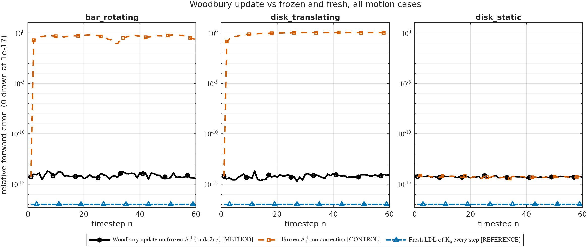
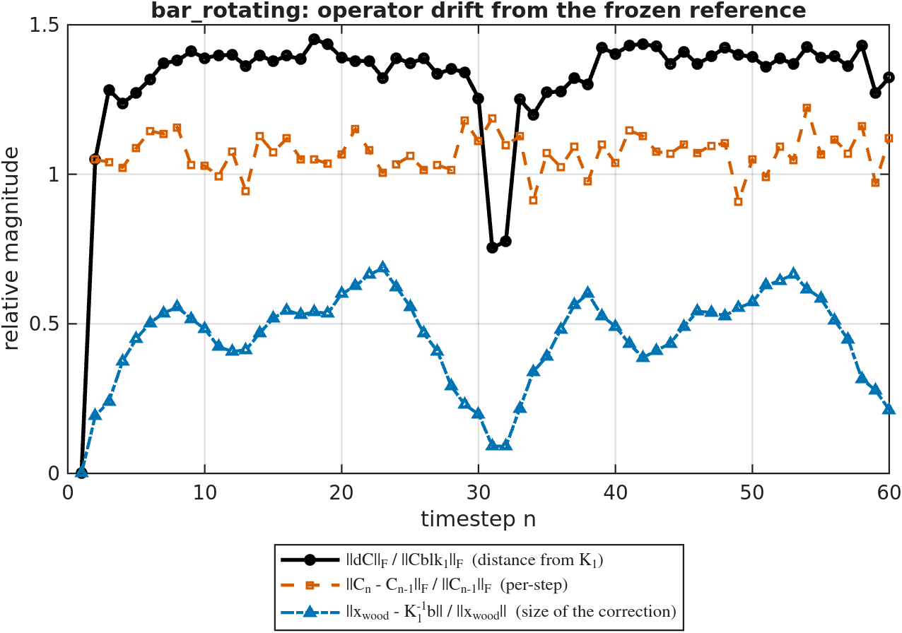
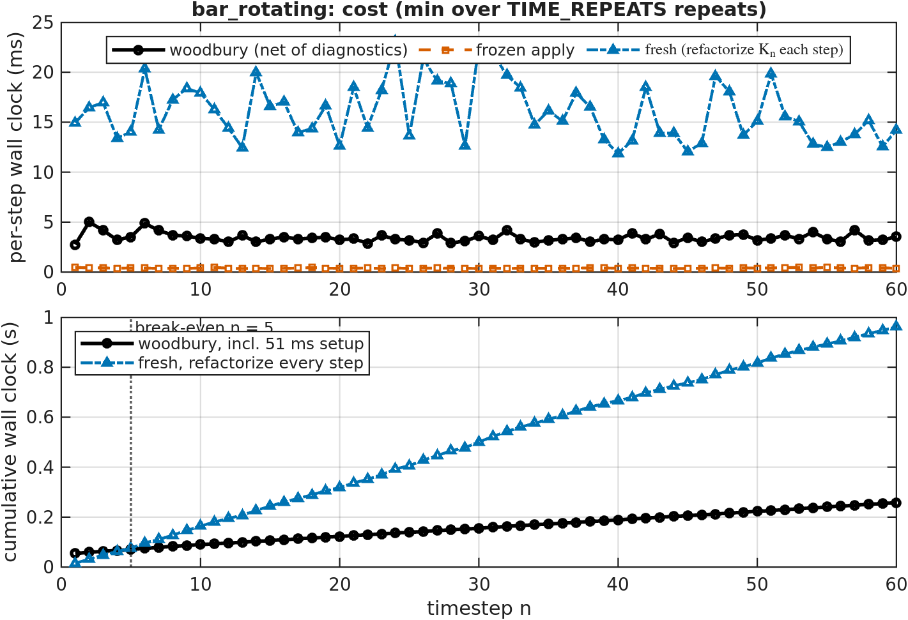

# Can ONE factorization of $A_1$ solve the whole immersed-rotor sequence?

**Yes — exactly, and about 2.5–4.4× cheaper per step than refactorizing.**

Over 60 timesteps the Woodbury update on a single frozen $\mathrm{LDL}^\top$ factorization of
$A_1 = K_1$ agrees with a fresh direct solve to $\le 2.0\times10^{-14}$ on every case (true
residual $\le 1.0\times10^{-13}$), while the *same* frozen factorization used **without** the
correction is 45–112 % wrong. The capacitance never becomes the problem:
$\kappa(\mathrm{Cap})$ stays between $1.2\times10^2$ and $4.0\times10^2$ even when the coupling
block has moved further than its own norm ($\|dC\|_F/\|C_1\|_F \approx 1.4$).

That accuracy is *not* explained by the operator being easy — $\kappa(K_n) \approx 3\times10^6$,
so a $\kappa(K)$-amplified error would be $\sim\!10^{-9}$. §4.1 measures why, and shows the
textbook SMW instability **can** be triggered on this very operator with an adversarial
right-hand side (error $1.6\times10^{-12}$ at cancellation ratio $\rho = 327$).



| case | $n$ | $n_C$ | $\max\frac{\|dC\|_F}{\|C_1\|_F}$ | woodbury err (mean / max) | frozen err (mean / max) | $\max\kappa(\mathrm{Cap})$ | speedup / step | break-even | total speedup |
|---|---|---|---|---|---|---|---|---|---|
| `bar_rotating`     | 5840 | 20 | 1.451 | 8.2e-15 / **2.0e-14** | 0.453 / **0.685** | 164 | **4.42×** | step 4  | 3.52× |
| `disk_translating` | 5864 | 44 | 1.418 | 6.5e-15 / **2.0e-14** | 0.960 / **1.119** | 403 | **2.51×** | step 4  | 2.33× |
| `disk_static`      | 5864 | 44 | 0     | 5.4e-15 / **7.4e-15** | 5.4e-15 / 7.4e-15 | 346 | 3.16×     | step 10 | 2.49× |

Maximum true relative residual $\|K_n x - b\|/\|b\|$: 1.0e-13, 4.0e-14, 1.5e-14.

---

## 1. What is being exploited

The immersed-rotor KKT sequence moves only in its coupling block, and the sequence kernel
already establishes — and re-asserts at every step of every run — that this makes the whole
sequence a **rank-$2n_C$ symmetric update of one fixed matrix**:

$$K_n = K_1 + U B U^\top, \qquad U = [\,dC,\ \mathrm{Sel}\,], \quad dC = \mathrm{Cblk}_n - \mathrm{Cblk}_1, \quad B = \begin{bmatrix} 0 & I \\ I & 0\end{bmatrix}$$

with $\mathrm{Sel} = [0;0;I_{n_C}]$ selecting the multiplier rows and $B^{-1} = B$. So Woodbury
applies directly, with $Y_0 = K_1^{-1}U = [\,Y_{dC},\ Y_{\mathrm{Sel}}\,]$:

$$\mathrm{Cap} = B + U^\top Y_0, \qquad x = K_1^{-1}b \;-\; Y_0\left(\mathrm{Cap}^{-1} U^\top K_1^{-1} b\right)$$

$\mathrm{Cap}$ is $2n_C \times 2n_C$ (40 or 88 here) and symmetric. This is **exact in exact
arithmetic** — not a preconditioner and not an approximation. The only thing it is exposed to
in floating point is $\kappa(\mathrm{Cap})$, which is why that is reported next to every solve.

This closes a loop the repo left open: `lowrank_update_basis.m` computes
`rcond_capacitance` and `woodbury_relerr` and says in its own docstring that they exist as
diagnostics "for a downstream Woodbury **SOLVE**". This study *is* that downstream use, and
`tests/test_capacitance.m` T4 checks the two agree — they match to all printed digits.

### Why $n_C$ backsolves and not $2n_C$

$\mathrm{Sel}$ is time-independent, so $Y_{\mathrm{Sel}} = K_1^{-1}\mathrm{Sel}$ and the whole
lower-right block $\mathrm{Sel}^\top K_1^{-1}\mathrm{Sel}$ of $\mathrm{Cap}$ are constant.
They are solved **once**, in `woodbury_context_init`. Per step only the $dC$ half is rebuilt:
$n_C$ backsolves plus one for the right-hand side, all batched into a single apply.
`test_woodbury_identity` T5 and `test_context_reuse` T4 pin this.

---

## 2. The result that decided the cost question

The first implementation used `decomposition(K_1)` to apply the frozen inverse and concluded
the method was **~5× slower** than refactorizing. That was an artifact of the MATLAB API, not
of the algebra. Measured at $h_0 = 0.05$, $n = 5840$, $\mathrm{nnz}(L) = 327{,}223$, 20 columns:

| applying $K_1^{-1}$ to 20 columns | time |
|---|---|
| `decomposition(K_1) \ B` | 47.6 ms |
| the five lines in `woodbury_apply_ref` | **1.8 ms** |

`decomposition`'s `mldivide` charges a large per-column cost and **does not batch** — 20
columns cost it 20× a single solve. The raw sparse triangular solves *do* batch (20 columns
cost 4.4× one column). Since batching is the entire reason the update is cheap, the factors
are stored raw (`ldl(K_1,'vector')`) and applied by hand. `test_context_reuse` T8/T9 pin both
the batching and the ≥2× advantage over `decomposition`, so if a future MATLAB fixes that path
the tests will say so.

### Timing choices, all of which cut against the method

- every solve is repeated `TIME_REPEATS` times and the **minimum** taken;
- the `fresh` arm is `K_n \ b` — MATLAB's fastest from-scratch path (17.8 ms vs 21.2 ms for
  `decomposition(K_n)\b`), so the method faces the toughest honest opponent;
- materializing $K_n$ is excluded from every arm's clock even though only `fresh` needs it;
- a warmup factorization runs before anything is timed, because the first sparse `ldl` of a
  session costs ~3× a warm one (96 ms vs 30 ms) and $t_{\mathrm{setup}}$ is paid exactly once —
  a cold measurement would inflate the break-even step threefold;
- `t_woodbury_net` excludes the `svd`/`rcond` diagnostics a production solve would not run
  (`t_woodbury` and `t_woodbury_diag` are recorded separately, nothing is hidden).

---

## 3. The three arms, and the control that makes them mean something

| key | what it computes | role |
|---|---|---|
| `woodbury` | frozen $\mathrm{LDL}$ of $K_1$ + the rank-$2n_C$ correction | **the method** |
| `frozen`   | $K_1^{-1}b_n$, no correction | control: what the correction buys |
| `fresh`    | $K_n \setminus b_n$, refactorized each step | accuracy reference + cost baseline |

All three are **direct** solves — there is no Krylov layer, so cost is wall clock and quality
is forward error. Iteration counts, the usual currency of the sibling benchmarks, do not exist
here.

No arm advances the state: $u_{\mathrm{prev}}$ is advanced with the backslash solution inside
`build_stokes_sequence`, exactly as the parent benchmark does, so all three see an identical
RHS sequence.

**What the error columns actually measure.** The reference is $x_{\mathrm{ref}} = K_n \setminus b_n$,
so `*_err` is *agreement with a reference direct solve*, not distance from the exact solution.
Since $\kappa(K_n) \approx 3\times10^6$, both solvers could in principle sit $\sim10^{-9}$ from
truth. `fresh_err == 0` in every row is therefore a **determinism/plumbing check, not an
accuracy check** — `fresh` runs the same algorithm as the reference, so agreeing with it is a
tautology. The independent accuracy evidence is (a) the true residual
$\|K_n x - b\|/\|b\| \le 1.0\times10^{-13}$, and (b) the known-solution test in §4.1, where
$x$ is constructed exactly and backslash itself lands at $4.9\times10^{-14}$.

`disk_static` is the falsification control. Its coupling is constant, so $dC$ is *exactly*
zero, hence $K_n = K_1$ exactly and the correction is provably zero — so it is **skipped**,
not computed and rounded. `test_static_control` asserts `correction_norm == 0` exactly, and
that the frozen inverse is accurate there. A scheme that works on a moving sequence but fails
this control is wired wrong.

---

## 4.1 Why is it this accurate? SMW is supposed to be unstable

The Woodbury/Sherman–Morrison formula has a bad reputation for stability, so
$2\times10^{-14}$ needs an explanation. It is **not** because this operator is well
conditioned — it is not: $\kappa(K_1) = 2.5\times10^6$ and $\kappa(K_n) \in [2.5, 3.1]\times10^6$,
so $\kappa(K_n)\varepsilon \approx 6\times10^{-10}$, five orders of magnitude worse than observed.

| step | $\kappa(K_n)$ | $\kappa(\mathrm{Cap})$ | $\rho = \|y\|/\|x\|$ | observed err | $\kappa(\mathrm{Cap})\,\varepsilon$ | $\kappa(K_n)\,\varepsilon$ |
|---|---|---|---|---|---|---|
| 2  | 2.61e6 | 156 | 0.85 | 9.9e-15 | 3.5e-14 | 5.8e-10 |
| 20 | 2.94e6 | 130 | 0.50 | 3.5e-15 | 2.9e-14 | 6.5e-10 |
| 40 | 3.07e6 | 124 | 0.58 | 1.4e-14 | 2.8e-14 | 6.8e-10 |
| 60 | 2.54e6 | 161 | 1.01 | 3.6e-15 | 3.6e-14 | 5.6e-10 |

**Reason 1: consistency buys backward stability.** $y = K_1^{-1}b$ and $Y_0 = K_1^{-1}U$ are
computed with the *same* factors — in fact in one batched `woodbury_apply_ref` call. Applying a
consistently perturbed $\tilde K_1^{-1} = (K_1+\Delta K_1)^{-1}$ throughout, the formula returns
*exactly*

$$(K_1 + \Delta K_1 + UBU^\top)^{-1} b = (K_n + \Delta K_1)^{-1} b$$

so the factorization's rounding is a **backward** perturbation of $K_n$ of size
$\varepsilon\|K_1\|$. Woodbury inherits the frozen factorization's backward stability instead of
amplifying its forward error. Using two different inverses — or refreshing the factors between
$Y_0$ and $y$ — would forfeit this.

**Reason 2: the real amplifier is cancellation, and it is absent here.** The formula subtracts
two vectors, so the error scales with
$\rho = \|K_1^{-1}b\| / \|K_n^{-1}b\|$. Measured $\rho \in [0.50, 1.01]$: the correction is
*smaller* than the answer, so no digits cancel. That is exactly the `correction_rel` curve in
the drift figure above — it is the stability parameter, not just a diagnostic.

**The instability is reachable on demand.** Take $b = K_n v$ with $v$ the leading singular
vector of $K_1^{-1}K_n$ (so $x = v$ exactly, no solve needed), which maximizes $\rho$:

| RHS at step 20 | $\rho$ | Woodbury err | backslash err |
|---|---|---|---|
| the physical one | 0.50 | 3.5e-15 | — |
| adversarial | **327** | **1.6e-12** | 4.9e-14 |

The error grows ~450× for a 650× change in $\rho$ while backslash is unmoved. So SMW's
instability is real on this operator; the rotor physics simply never produces such a
right-hand side.

**Why $\kappa(\mathrm{Cap})$ stays small** is structural: with $K_1$ nonsingular,
$\mathrm{Cap}$ is singular iff $K_n$ is. Every $K_n$ here is an equally well-posed KKT system,
so $\mathrm{Cap}$ never nears singularity. The regime to fear is an update that *changes* the
conditioning — above all $\kappa(K_n) \ll \kappa(K_1)$, where a well-conditioned answer would
have to be reconstructed from ill-conditioned pieces.

**What this does not establish:** that the error scales *as* $\kappa(\mathrm{Cap})\varepsilon$.
Across 120 rows $\kappa(\mathrm{Cap})$ varies only 3.4× while the error varies 10×, with
correlation $-0.19$ — the right order of magnitude, but the exponent is unresolved by this data.
The $\rho$ scaling, by contrast, is confirmed by the table above.

## 4.2 What the figures show

`bar_rotating`, drift from the frozen reference:



The sharp dip at step 31 is not noise. The rotor turns twice over $T_{\max} = dt\cdot T_{step}$,
so one full revolution takes ~30.5 steps and at step 31 the bar has returned to (a permutation
of) its step-1 configuration — independently reproducing the $\pi$-symmetry the parent's
`extract_kkt_examples.m` documents. The Woodbury correction's magnitude (blue) tracks it.

Cost, per step and cumulative:



The cumulative panel is the one that answers the question: the method pays for one
factorization up front (66 ms $\approx$ 3.5 fresh solves) and is ahead from step 4 onward.

---

## 5. Layout

| file | role |
|---|---|
| `add_woodbury_paths.m` | path bootstrap; documents the shadowing hazard below |
| `assert_woodbury_helpers.m` | anti-shadowing guard; pins `define_motion_list` to the sibling |
| `make_woodbury_params.m` | all knobs, each with its reason |
| `woodbury_context_init.m` | **the one factorization**; caches $Y_{\mathrm{Sel}}$ and $\mathrm{Sel}^\top K_1^{-1}\mathrm{Sel}$ |
| `woodbury_apply_ref.m` | applies $K_1^{-1}$ by hand — see §2 |
| `woodbury_solve.m` | the per-step Woodbury solve + capacitance diagnostics |
| `solve_woodbury_sequence.m` | engine: one case, three arms, `Astat` |
| `run_woodbury_benchmark.m` | driver: all cases → CSVs → figures |
| `run_woodbury_stability.m` | reproduces §4.1: which condition number the error follows, and the adversarial-RHS experiment |
| `write_woodbury_outputs.m` | per-case + summary CSVs (the contract, see below) |
| `write_woodbury_figures.m` | every figure, **from the CSVs only** |
| `replot_woodbury.m` | redraw without re-solving |
| `woodbury_fig_defaults.m`, `save_woodbury_figure.m`, `woodbury_style_table.m` | figure style (renamed local copies) |
| `tests/run_all_tests.m` + 5 scripts | 47 assertions, ~20 s |
| `woodbury_direct/` | the committed run: 3 CSVs + 16 figures (this README embeds them) |

Reused rather than copied: `define_motion_list.m` from the sibling benchmark by path, and
`build_stokes_sequence` / `seq_K` / `seq_dCblk` from
`../linear_solves/subspace_recycle/kernel/`. Nothing was added to `+src`.

**The CSVs are the contract** between the expensive run and cheap figure regeneration.
`write_woodbury_figures` reads only `<case>_results.csv` and `woodbury_summary.csv`, never an
`Astat`, so adding a figure that needs a new quantity means adding the column first —
`test_engine_smoke` T5c enforces exactly that.

### Why every local helper is renamed

The Schur twin copies `save_benchmark_figure` / `benchmark_fig_defaults` /
`solver_style_table` under their **original** names and relies on `addpath('-begin')` to win
over the sibling folder's copies. That ordering cannot be relied on here:
`build_stokes_sequence` calls `add_recycle_paths()` internally, which **prepends** the sibling
rotor directory *mid-run*, after our `-begin`. Rather than fight for path position, every
helper here carries a `woodbury_` / `_woodbury` name, so there is no collision to lose —
including `assert_woodbury_helpers`, so the guard cannot itself be shadowed.

---

## 6. Running

```matlab
% unit gate (~20 s)
cd tests; run_all_tests

% smoke run: h0 = 0.1, 5 steps -> woodbury_direct_smoke/
SMOKE_TEST = true; run_woodbury_benchmark

% the full benchmark: 3 cases x 60 steps at h0 = 0.05 (~23 s + sequence build)
clear SMOKE_TEST; run_woodbury_benchmark

% redraw figures from the committed CSVs, solving nothing
replot_woodbury
```

`SMOKE_TEST` trims `max_steps`, **not** `Tstep`: `Tstep` sets $T_{\max}$ and hence the rotor's
angular velocity, so shrinking it would change the geometry under test rather than just doing
fewer solves.

---

## 7. Limits, and what this does not claim

- **The reference is hard-frozen at step 1, with no refresh knob**, by design — a cadence
  parameter would let the question "can one factorization serve the sequence?" be answered by
  refactorizing. Re-anchoring is a follow-up study, not a parameter.
- **The stability regime is not probed by the physical sequence.** Both amplifiers stay
  benign here — $\kappa(\mathrm{Cap}) \le 4\times10^2$ and the cancellation ratio
  $\rho \le 1.01$ — so this run shows the bad regime is *not reached* over a 60-step,
  2-revolution rotor sequence at $\|dC\|_F/\|C_1\|_F \approx 1.4$, **not** that it cannot be
  reached. §4.1 reaches it deliberately with an adversarial right-hand side ($\rho = 327$,
  error $1.6\times10^{-12}$). A finer mesh, more multipliers, a stiffer coupling, or a
  reference whose conditioning differs from the target's could find it for real. If
  `woodbury_err` ever climbs, the natural next steps are one sweep of iterative refinement
  (cheap: the correction is already exact to $10^{-14}$) or a re-anchored reference.
- **The error's dependence on $\kappa(\mathrm{Cap})$ is unresolved** — it varies too little
  across this run (3.4×) to fit an exponent. Only the $\rho$ dependence is established.
- **The low-rank form requires $n_C$ constant.** `build_stokes_sequence` hard-asserts this;
  a Lagrange point leaving the mesh would change $\mathrm{Sel}$ and invalidate the fixed
  selector. All three cases here keep $n_C$ constant throughout.
- **The speedup is measured against MATLAB's sparse `ldl`, on one machine.** It is a ratio of
  two direct solves on the same operator, not a claim about direct solvers in general; the
  break-even step in particular scales with how expensive one factorization is relative to
  $n_C$ batched backsolves.
- **`disk_static` breaks even at step 10, not 4**, because the arm still performs its $n_C$
  backsolves (the cost path is kept uniform so timings stay representative) while the
  correction itself is skipped. Its speedup is real but its break-even is pessimistic.
