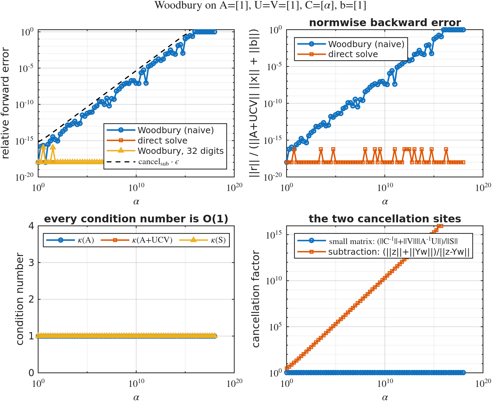
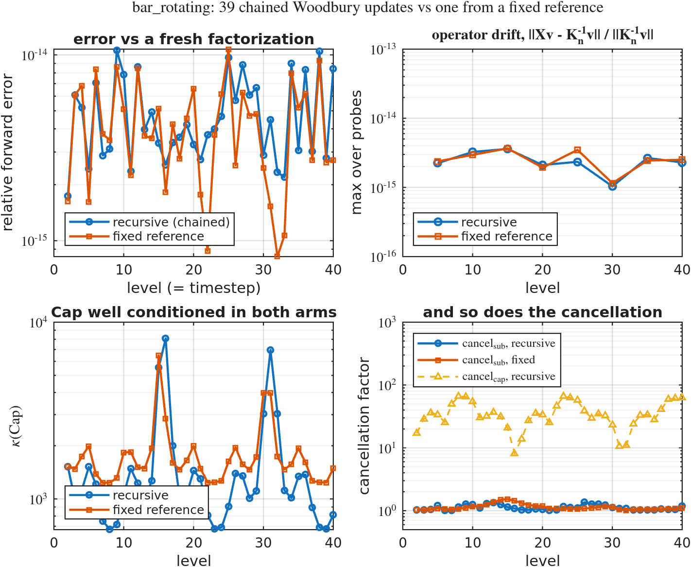

# Can ONE factorization of $A_1$ solve the whole immersed-rotor sequence?

**Yes — exactly, and about 2.9–3.6× cheaper per step than refactorizing.**

Over 60 timesteps the Woodbury update on a single frozen $\mathrm{LDL}^\top$ factorization of
$A_1 = K_1$ agrees with a fresh direct solve to $\le 2.0\times10^{-14}$ on every case (true
residual $\le 1.0\times10^{-13}$), while the *same* frozen factorization used **without** the
correction is 45–112 % wrong. The capacitance never becomes the problem:
$\kappa(\mathrm{Cap})$ stays between $1.2\times10^2$ and $4.0\times10^2$ even when the coupling
block has moved further than its own norm ($\|dC\|_F/\|C_1\|_F \approx 1.4$).

That accuracy is *not* explained by the operator being easy — $\kappa(K_n) \approx 3\times10^6$,
so a $\kappa(K)$-amplified error would be $\sim\!10^{-9}$. §4.1 measures why, and shows the
textbook SMW instability **can** be triggered on this very operator with an adversarial
right-hand side (error $1.6\times10^{-12}$ at cancellation ratio $\rho = 327$).

It is also *not* explained by the implementation being careful. `woodbury_solve` is a
deliberately **naive** evaluation of the identity — no symmetrization of $\mathrm{Cap}$, $C^{-1}$
formed explicitly, no orthogonalization, no iterative refinement, and no special case for
$dC = 0$ — so that the reported accuracy belongs to the problem and not to the defenses.
§4.3 breaks that same evaluation on two constructed systems whose condition numbers are all
$1$, losing every digit; §4.4 says which properties of the rotor problem stop it here.


| case | $n$ | $n_C$ | $\max\frac{\|dC\|_F}{\|C_1\|_F}$ | woodbury err (mean / max) | frozen err (mean / max) | $\max\kappa(\mathrm{Cap})$ | speedup / step | break-even | total speedup |
|---|---|---|---|---|---|---|---|---|---|
| `bar_rotating`     | 5840 | 20 | 1.451 | 8.1e-15 / **1.9e-14** | 0.453 / **0.685** | 164 | **3.58×** | step 5 | 3.19× |
| `disk_translating` | 5864 | 44 | 1.418 | 6.6e-15 / **2.0e-14** | 0.960 / **1.119** | 403 | **2.93×** | step 3 | 2.65× |
| `disk_static`      | 5864 | 44 | 0     | 5.4e-15 / **7.4e-15** | 5.4e-15 / 7.4e-15 | 346 | 2.90×     | step 4 | 2.65× |

Maximum true relative residual $\|K_n x - b\|/\|b\|$: 9.9e-14, 4.0e-14, 1.5e-14.

---

## 1. What is being exploited

The immersed-rotor KKT sequence moves only in its coupling block, and the sequence kernel
already establishes — and re-asserts at every step of every run — that this makes the whole
sequence a **rank-$2n_C$ symmetric update of one fixed matrix**:

$$K_n = K_1 + U B U^\top, \qquad U = [\,dC,\ \mathrm{Sel}\,], \quad dC = \mathrm{Cblk}_n - \mathrm{Cblk}_1, \quad B = \begin{bmatrix} 0 & I \\ I & 0\end{bmatrix}$$

with $\mathrm{Sel} = [0;0;I_{n_C}]$ selecting the multiplier rows and $B^{-1} = B$. So Woodbury
applies directly, with $Y_0 = K_1^{-1}U = [\,Y_{dC},\ Y_{\mathrm{Sel}}\,]$:

$$\mathrm{Cap} = B + U^\top Y_0, \qquad x = K_1^{-1}b \;-\; Y_0\left(\mathrm{Cap}^{-1} U^\top K_1^{-1} b\right)$$

$\mathrm{Cap}$ is $2n_C \times 2n_C$ (40 or 88 here) and symmetric in exact arithmetic — it is
*not* symmetrized in code, see §4.3. This is **exact in exact arithmetic** — not a
preconditioner and not an approximation — so what it is exposed to in floating point is
cancellation, at the two sites §4.3 isolates. $\kappa(\mathrm{Cap})$ and both cancellation
factors are reported next to every solve.

This closes a loop the repo left open: `lowrank_update_basis.m` computes
`rcond_capacitance` and `woodbury_relerr` and says in its own docstring that they exist as
diagnostics "for a downstream Woodbury **SOLVE**". This study *is* that downstream use, and
`tests/test_capacitance.m` T4 checks the two agree — they match to all printed digits.

### Why $n_C$ backsolves and not $2n_C$

$\mathrm{Sel}$ is time-independent, so $Y_{\mathrm{Sel}} = K_1^{-1}\mathrm{Sel}$ is constant and
is solved **once**, in `woodbury_context_init`. Per step only the $dC$ half is rebuilt: $n_C$
backsolves plus one for the right-hand side, all batched into a single apply.
`test_woodbury_identity` T5 and `test_context_reuse` T4 pin this.

This is a saving in **backsolves**, which is what the cost claim is about, and it changes no
arithmetic — the same frozen factors are applied to the same columns either way. $\mathrm{Cap}$
itself is then formed in one $C^{-1} + U^\top Y_0$ product per step, blocks and all; reusing
the cached $\mathrm{Sel}^\top Y_{\mathrm{Sel}}$ block would save a dense GEMM but would mean
assembling $\mathrm{Cap}$ by hand rather than writing the identity down, which §4.3 explains
this study will not do.

---

## 2. The result that decided the cost question

The first implementation used `decomposition(K_1)` to apply the frozen inverse and concluded
the method was **~5× slower** than refactorizing. That was an artifact of the MATLAB API, not
of the algebra. Measured at $h_0 = 0.05$, $n = 5840$, $\mathrm{nnz}(L) = 327{,}223$, 20 columns:

| applying $K_1^{-1}$ to 20 columns | time |
|---|---|
| `decomposition(K_1) \ B` | 47.6 ms |
| the five lines in `woodbury_apply_ref` | **1.8 ms** |

`decomposition`'s `mldivide` charges a large per-column cost and **does not batch** — 20
columns cost it 20× a single solve. The raw sparse triangular solves *do* batch (20 columns
cost 4.4× one column). Since batching is the entire reason the update is cheap, the factors
are stored raw (`ldl(K_1,'vector')`) and applied by hand. `test_context_reuse` T8/T9 pin both
the batching and the ≥2× advantage over `decomposition`, so if a future MATLAB fixes that path
the tests will say so.

### Timing choices, all of which cut against the method

- every solve is repeated `TIME_REPEATS` times and the **minimum** taken;
- the `fresh` arm is `K_n \ b` — MATLAB's fastest from-scratch path (17.8 ms vs 21.2 ms for
  `decomposition(K_n)\b`), so the method faces the toughest honest opponent;
- materializing $K_n$ is excluded from every arm's clock even though only `fresh` needs it;
- a warmup factorization runs before anything is timed, because the first sparse `ldl` of a
  session costs ~3× a warm one (96 ms vs 30 ms) and $t_{\mathrm{setup}}$ is paid exactly once —
  a cold measurement would inflate the break-even step threefold;
- `t_woodbury_net` excludes the `svd`/`rcond` diagnostics a production solve would not run
  (`t_woodbury` and `t_woodbury_diag` are recorded separately, nothing is hidden).

---

## 3. The three arms, and the control that makes them mean something

| key | what it computes | role |
|---|---|---|
| `woodbury` | frozen $\mathrm{LDL}$ of $K_1$ + the rank-$2n_C$ correction | **the method** |
| `frozen`   | $K_1^{-1}b_n$, no correction | control: what the correction buys |
| `fresh`    | $K_n \setminus b_n$, refactorized each step | accuracy reference + cost baseline |

All three are **direct** solves — there is no Krylov layer, so cost is wall clock and quality
is forward error. Iteration counts, the usual currency of the sibling benchmarks, do not exist
here.

No arm advances the state: $u_{\mathrm{prev}}$ is advanced with the backslash solution inside
`build_stokes_sequence`, exactly as the parent benchmark does, so all three see an identical
RHS sequence.

**What the error columns actually measure.** The reference is $x_{\mathrm{ref}} = K_n \setminus b_n$,
so `*_err` is *agreement with a reference direct solve*, not distance from the exact solution.
Since $\kappa(K_n) \approx 3\times10^6$, both solvers could in principle sit $\sim10^{-9}$ from
truth. `fresh_err == 0` in every row is therefore a **determinism/plumbing check, not an
accuracy check** — `fresh` runs the same algorithm as the reference, so agreeing with it is a
tautology. The independent accuracy evidence is (a) the true residual
$\|K_n x - b\|/\|b\| \le 1.0\times10^{-13}$, and (b) the known-solution test in §4.1, where
$x$ is constructed exactly and backslash itself lands at $4.9\times10^{-14}$.

`disk_static` is the falsification control. Its coupling is constant, so $dC$ is *exactly*
zero, hence $K_n = K_1$ exactly and the correction is provably zero. It is **not** skipped —
the naive path has no $dC = 0$ branch and computes and rounds it like any other step — so
`test_static_control` asserts that the correction *vanishes* ($< 10^{-13}$), not that it was
avoided, plus that the frozen inverse is accurate there. In practice it comes out exactly
zero, and structurally so: with $dC = 0$ the first block row of $\mathrm{Cap}$ is
$[\,0\ \ I\,]$ against a zero right-hand side, which forces the $\mathrm{Sel}$ half of $w$ to
zero while the $dC$ half of $Y_0$ is the exact zero matrix. A scheme that works on a moving
sequence but fails this control is wired wrong.

---

## 4.1 Why is it this accurate? SMW is supposed to be unstable

The Woodbury/Sherman–Morrison formula has a bad reputation for stability, so
$2\times10^{-14}$ needs an explanation. It is **not** because this operator is well
conditioned — it is not: $\kappa(K_1) = 2.5\times10^6$ and $\kappa(K_n) \in [2.5, 3.1]\times10^6$,
so $\kappa(K_n)\varepsilon \approx 6\times10^{-10}$, five orders of magnitude worse than observed.

| step | $\kappa(K_n)$ | $\kappa(\mathrm{Cap})$ | $\rho = \|y\|/\|x\|$ | observed err | $\kappa(\mathrm{Cap})\,\varepsilon$ | $\kappa(K_n)\,\varepsilon$ |
|---|---|---|---|---|---|---|
| 2  | 2.61e6 | 156 | 0.85 | 9.8e-15 | 3.5e-14 | 5.8e-10 |
| 20 | 2.94e6 | 130 | 0.50 | 3.3e-15 | 2.9e-14 | 6.5e-10 |
| 40 | 3.07e6 | 124 | 0.58 | 1.4e-14 | 2.8e-14 | 6.8e-10 |
| 60 | 2.54e6 | 161 | 1.01 | 3.7e-15 | 3.6e-14 | 5.6e-10 |

**Reason 1: consistency buys backward stability.** $y = K_1^{-1}b$ and $Y_0 = K_1^{-1}U$ are
computed with the *same* factors — in fact in one batched `woodbury_apply_ref` call. Applying a
consistently perturbed $\tilde K_1^{-1} = (K_1+\Delta K_1)^{-1}$ throughout, the formula returns
*exactly*

$$(K_1 + \Delta K_1 + UBU^\top)^{-1} b = (K_n + \Delta K_1)^{-1} b$$

so the factorization's rounding is a **backward** perturbation of $K_n$ of size
$\varepsilon\|K_1\|$. Woodbury inherits the frozen factorization's backward stability instead of
amplifying its forward error. Using two different inverses — or refreshing the factors between
$Y_0$ and $y$ — would forfeit this.

**Reason 2: the real amplifier is cancellation, and it is absent here.** The formula subtracts
two vectors, so the error scales with
$\rho = \|K_1^{-1}b\| / \|K_n^{-1}b\|$. Measured $\rho \in [0.50, 1.01]$: the correction is
*smaller* than the answer, so no digits cancel. That is exactly the `correction_rel` curve in
the drift figure above — it is the stability parameter, not just a diagnostic.

**The instability is reachable on demand.** Take $b = K_n v$ with $v$ the leading singular
vector of $K_1^{-1}K_n$ (so $x = v$ exactly, no solve needed), which maximizes $\rho$:

| RHS at step 20 | $\rho$ | Woodbury err | backslash err |
|---|---|---|---|
| the physical one | 0.50 | 3.5e-15 | — |
| adversarial | **327** | **1.6e-12** | 4.9e-14 |

The error grows ~450× for a 650× change in $\rho$ while backslash is unmoved. So SMW's
instability is real on this operator; the rotor physics simply never produces such a
right-hand side.

**Why $\kappa(\mathrm{Cap})$ stays small** is structural: with $K_1$ nonsingular,
$\mathrm{Cap}$ is singular iff $K_n$ is. Every $K_n$ here is an equally well-posed KKT system,
so $\mathrm{Cap}$ never nears singularity. The regime to fear is an update that *changes* the
conditioning — above all $\kappa(K_n) \ll \kappa(K_1)$, where a well-conditioned answer would
have to be reconstructed from ill-conditioned pieces.

**What this does not establish:** that the error scales *as* $\kappa(\mathrm{Cap})\varepsilon$.
Across 120 rows $\kappa(\mathrm{Cap})$ varies only 3.4× while the error varies 10×, with
correlation $-0.19$ — the right order of magnitude, but the exponent is unresolved by this data.
The $\rho$ scaling, by contrast, is confirmed by the table above.

### Why $U$ is NOT orthogonalized

The reflex for low-rank updates is to orthogonalize the factors (the kernel's
`lowrank_update_basis` does exactly that — but there only the *span* matters, so it is free).
Here it is measured to be neutral at best, and structurally worse. Three reasons:

**(a) $U$'s two blocks are already exactly orthogonal.** $dC = [\,C_u;0;0\,]$ occupies only the
velocity rows and $\mathrm{Sel} = [\,0;0;I\,]$ only the multiplier rows — disjoint support, so
$\|dC^\top\mathrm{Sel}\| = 0$ *exactly* at every step. And $dC$ is well conditioned on its own
($\kappa(dC) = 1.2$–$4.7$, column norms within $4.7\times$). There is nothing to normalize.

**(b) $\rho$ is basis-independent.** It involves only $b$, $K_1$ and $K_n$ — not $U$ — so no
reparametrization of $U$ can touch the dominant error term. Measured head to head:

| step | err, current | err, orthogonalized |
|---|---|---|
| 2  | 9.77e-15 | 9.97e-15 |
| 20 | 3.28e-15 | 2.90e-15 |
| 40 | 1.37e-14 | 1.44e-14 |
| adversarial ($\rho=327$) | 1.585e-12 | 1.518e-12 |

Noise in both directions, and 2.5 % on the one case where the error *is* bad.

**(c) It would forfeit a robustness the current form has.** Orthogonalizing $dC = Q_d R_d$ makes
the middle matrix $\tilde B = \begin{bmatrix}0 & R_d\\ R_d^\top & 0\end{bmatrix}$, whose inverse
requires $R_d^{-1}$. The current $B = \begin{bmatrix}0&I\\I&0\end{bmatrix}$ **is** its own
inverse ($\kappa(B)=1$) and is never inverted. Because the $I$ blocks couple the two halves,
$dC\,v = 0$ still gives $\mathrm{Cap}\,[v;0] = [0;v] \neq 0$ — so $\mathrm{Cap}$ is nonsingular
*whatever $dC$'s rank*. Forcing a duplicate column:

| | current form | orthogonalized |
|---|---|---|
| rank-deficient $dC$ (rank $n_C\!-\!1$) | $\kappa(\mathrm{Cap}) = 1.7\times10^3$ ✓ | $\kappa(R_d) = 1.0\times10^{17}$ ✗ |

`tests/test_capacitance.m` T8–T9 pin all of this, so a later "clean-up" that orthogonalizes
$U$ fails loudly rather than silently losing rank robustness.

Orthogonalization *would* matter if the factors were badly scaled or nearly dependent, or if
updates **accumulated** ($K_n = K_{n-1} + \ldots$, basis degrading over time). Neither applies:
$dC$ is recomputed from scratch against a fixed reference every step, so nothing compounds —
which is why `test_context_reuse` T6 (solve the sequence backwards, get bit-identical iterates)
passes.

## 4.2 What the figures show

`bar_rotating`, drift from the frozen reference:


The sharp dip at step 31 is not noise. The rotor turns twice over $T_{\max} = dt\cdot T_{step}$,
so one full revolution takes ~30.5 steps and at step 31 the bar has returned to (a permutation
of) its step-1 configuration — independently reproducing the $\pi$-symmetry the parent's
`extract_kkt_examples.m` documents. The Woodbury correction's magnitude (blue) tracks it.

Cost, per step and cumulative:


The cumulative panel is the one that answers the question: the method pays for one
factorization up front (43 ms $\approx$ 2 fresh solves) and is ahead from step 5 onward.

---

## 4.3 Where the instability actually lives

A benign result from a method that cannot fail is not evidence. So `woodbury_naive` — the same
expression, in the same order, on small dense systems — is run on two constructed families
where it loses everything. **In both, every condition number in sight is $1$.** These are not
ill-posed problems solved badly; they are well-posed problems *evaluated* badly.

Run `run_woodbury_scalar_stress`; `tests/test_stress_metrics.m` holds the numbers in place.

### The two cancellation sites

The identity has exactly two places where digits can annihilate, and they are independent:

$$\mathrm{cancel}_S = \frac{\|C^{-1}\| + \|V\|\,\|A^{-1}U\|}{\|S\|}, \qquad
  \mathrm{cancel}_{\mathrm{sub}} = \frac{\|z\| + \|Yw\|}{\|z - Yw\|}$$

with $S = C^{-1} + VA^{-1}U$, $z = A^{-1}b$, $Y = A^{-1}U$. Both equal $1$ when nothing cancels.
Neither is a function of $\kappa(A)$ or $\kappa(A+UCV)$ — that is the whole point.

### Family 1 — the final subtraction

$A = [1]$, $U = V = [1]$, $C = [\alpha]$, $b = [1]$, so $x = 1/(1+\alpha)$ exactly. Woodbury
evaluates it as $1 - \alpha/(1+\alpha)$: a difference of two numbers of size $1$ producing an
answer of size $10^{-18}$.

| $\alpha$ | Woodbury | direct solve | 32-digit Woodbury | backward err | $\kappa$'s | $\mathrm{cancel}_S$ | $\mathrm{cancel}_{\mathrm{sub}}$ |
|---|---|---|---|---|---|---|---|
| 1e8  | 7.2e-09 | 0 | 0 | 3.6e-09 | 1 | 1 | 2.0e8 |
| 1e12 | 8.9e-05 | 0 | 0 | 4.4e-05 | 1 | 1 | 2.0e12 |
| 1e15 | 1.1e-01 | 0 | 0 | 5.2e-02 | 1 | 1 | 1.8e15 |
| **1e16** | **1.000** | **0** | **1.2e-16** | **1.000** | **1** | **1** | $\infty$ |

At $\alpha = 10^{16}$ the subtraction returns **exactly zero** while the answer is $10^{-16}$.
Three things are worth separating:

- **It is not a conditioning failure.** $\kappa(A) = \kappa(A+UCV) = \kappa(S) = 1$ throughout,
  and the direct solve is exact at every $\alpha$.
- **It is not backward stable either.** The backward error reaches $1.0$ — the computed iterate
  does not solve *any* nearby system, so this cannot be re-described as a well-behaved solve of a
  perturbed problem.
- **It is a precision failure, not a formula failure.** The identical expression in ~32-digit
  double-double arithmetic (`dd_woodbury_scalar`) returns $1.2\times10^{-16}$. The identity is
  fine; the cancellation spent precision the format did not have.

Across the whole sweep the error obeys $\text{err} \le 0.33 \cdot \mathrm{cancel}_{\mathrm{sub}}\varepsilon$
— predicted by the cancellation factor, never by a $\kappa$.



### Family 2 — the small matrix

Family 1 leaves $\mathrm{cancel}_S = 1$, so it says nothing about the other site. With
$a_0 = 1/3$, $A = [a_0(1+\eta)]$, $U = V = [1]$, $C = [-a_0]$: now
$S = -1/a_0 + 1/A$ cancels two numbers of size $3$ into one of size $3\eta$, and its one-ulp
absolute error is an $\varepsilon/\eta$ *relative* error. Here $A + UCV = A - a_0$ is exact by
Sterbenz, so the solution $1/(A-a_0)$ is known in closed form rather than solved for.

| $\eta$ | Woodbury err | direct solve | $\kappa(A)$, $\kappa(A{+}UCV)$, $\kappa(S)$ | $\mathrm{cancel}_S$ | $\mathrm{cancel}_{\mathrm{sub}}$ |
|---|---|---|---|---|---|
| 5.0e-16 | **1.25e-01** | 0 | 1, 1, 1 | 4.5e15 | 1.000 |
| 5.0e-15 | 2.57e-02 | 0 | 1, 1, 1 | 4.0e14 | 1.000 |
| 5.0e-14 | 1.85e-03 | 0 | 1, 1, 1 | 4.0e13 | 1.000 |
| 5.0e-12 | 2.58e-05 | 0 | 1, 1, 1 | 4.0e11 | 1.000 |
| 5.0e-05 | 2.12e-12 | 0 | 1, 1, 1 | 4.0e04 | 1.000 |

$\mathrm{cancel}_{\mathrm{sub}}$ is exactly $1$ at every row — the final subtraction is
innocent — and the error tracks $\mathrm{cancel}_S\varepsilon$ instead (ratio: median 0.15, max
0.29, across 11 decades, $r = 0.995$ in log–log). **The two factors are not interchangeable
diagnostics; each governs its own mechanism, and each family isolates one.**

One implementation note that took a rebuild to find: anchoring at $a_0 = 1$ instead of $1/3$ is
*degenerate*. The true $1/(1+\eta) = 1 - \eta + \eta^2$ sits within $\eta^2$ of the
representable $1-\eta$, so $\mathrm{fl}(1/A)$ carries a rounding of $\eta^2$ rather than of
$\varepsilon$ and the mechanism never fires — the error saturates near $\sqrt\varepsilon$. Off a
power of two, $1/A$ lands generically between doubles and the full ulp is lost.

### Chaining updates does not compound

The other standard worry is accumulation: a sequence of updates, each built on the last one's
rounding. `run_woodbury_recursive` builds exactly that — level $k$ treats the level $k{-}1$
*operator* as its $A^{-1}$ and applies the incremental $U_k = [\,C_k - C_{k-1},\ \mathrm{Sel}\,]$
— and runs it 39 levels deep against the production scheme on the same steps. The increments
telescope, so both arms represent the same inverse and every difference is floating point.

| | error at level 2 | at level 40 | ratio recursive/fixed | operator drift, level 40 |
|---|---|---|---|---|
| recursive (39 chained) | 1.7e-15 | 8.4e-15 | median **1.12**, max 4.2 | 2.3e-15 |
| fixed reference | 1.6e-15 | 2.7e-15 | — | 2.5e-15 |

The ratio is **flat in depth**, and the scatter between neighbouring levels is larger than the
trend. Depth is not the variable. The reason is in the per-level cancellation: every level has
$\mathrm{cancel}_{\mathrm{sub}} \approx 1$, so each correction is individually backward stable
and the errors add rather than amplify.

On the *adversarial* right-hand side the chained arm is in fact the **better** one —
$1.5\times10^{-13}$ against $8.7\times10^{-13}$ — because the fixed reference makes one jump at
$\rho = 39$ while the chain makes 39 small jumps each at $\rho \approx 1$, and $\rho$ is what
costs digits. Recursion is dangerous when the *per-level* cancellation is large, not because it
is deep. `tests/test_recursive_growth.m` is a regression guard on this negative result.



## 4.4 So why does none of it happen here?

The same instruments, on the physical sequence (`run_woodbury_stability` PART 1b):

| step | forward err | residual | backward err | $\mathrm{cancel}_{\mathrm{cap}}$ | $\mathrm{cancel}_{\mathrm{sub}}$ |
|---|---|---|---|---|---|
| 2  | 9.8e-15 | 3.1e-14 | 6.2e-19 | 78 | 1.05 |
| 20 | 3.3e-15 | 5.4e-14 | 7.8e-19 | 91 | 1.10 |
| 40 | 1.4e-14 | 5.8e-14 | 7.7e-19 | 92 | 1.08 |
| 60 | 3.7e-15 | 1.7e-14 | 4.7e-19 | 87 | 1.22 |

Six structural reasons, each tied to a measurement or a test rather than asserted:

1. **$C$ is an involution.** Here $C = B = \begin{bmatrix}0&I\\I&0\end{bmatrix}$, so
   $C^{-1} = C$ *exactly* and $\kappa(C) = 1$. The $C^{-1}$ term of $S$ is formed with zero
   error and contributes nothing to cancel. This is why $\mathrm{cancel}_{\mathrm{cap}}$
   stays at $\sim10^2$ instead of the $10^{14}$ family 2 reaches.
2. **$\kappa(\mathrm{Cap})$ is bounded structurally, not luckily.** With $K_1$ nonsingular,
   $\mathrm{Cap}$ is singular *iff* $K_n$ is; every $K_n$ here is an equally well-posed KKT
   system. And because the identity blocks couple the halves, $dC\,v = 0$ still gives
   $\mathrm{Cap}\,[v;0] = [0;v] \ne 0$ — so $\mathrm{Cap}$ is nonsingular whatever $dC$'s rank
   (`test_capacitance` T9).
3. **$U$'s blocks are exactly orthogonal.** $dC$ occupies only velocity rows and $\mathrm{Sel}$
   only multiplier rows, so $\|dC^\top\mathrm{Sel}\| = 0$ *exactly* (`test_capacitance` T8).
4. **$\rho \in [0.50, 1.01]$ — the correction is smaller than the answer it corrects**, so the
   final subtraction annihilates nothing ($\mathrm{cancel}_{\mathrm{sub}} \le 1.22$). This is
   the one that would break first, and §4.1 breaks it deliberately: an adversarial right-hand
   side reaches $\rho = 327$ and costs three digits.
5. **$z$ and $Y_0$ go through the same frozen factors**, so the factorization's rounding is a
   *backward* perturbation of $K_n$ rather than an amplified forward error — which is why the
   measured backward error is $\sim\!10^{-18}$ rather than the $1.0$ of family 1.
6. **$dC$ is re-anchored against a fixed reference every step**, so nothing accumulates. This
   is the only one of the six that turned out **not** to be load-bearing: §4.3 removes it and
   the error does not move.

**The honest summary.** The mechanism that destroys Woodbury is present and instrumented here;
it is simply not excited. The rotor sequence never asks for a cancelling right-hand side, and
the middle matrix it happens to supply is its own inverse. Neither is a property of the
*method*, so neither transfers for free to another problem — a stiffer coupling, a general
$C$ needing an inexact $C^{-1}$, or a reference whose conditioning differs from the target's
could each excite one of the two sites. Both are cheap to watch: `info.cancel_cap` and
`info.cancel_sub` are recorded on every solve.

**Caveat.** On this sequence $\kappa(\mathrm{Cap})$ and $\mathrm{cancel}_{\mathrm{cap}}$ are
both $\sim10^2$, so these rows cannot separate which of the two sets the scale. What they do
settle is that neither is $\kappa(K_n)\varepsilon \approx 6\times10^{-10}$. The constructed
families *do* separate them: there $\kappa(S) = 1$ while $\mathrm{cancel}_S$ reaches
$4\times10^{15}$, and the error follows $\mathrm{cancel}_S$.

---

## 5. Layout

| file | role |
|---|---|
| `add_woodbury_paths.m` | path bootstrap; documents the shadowing hazard below |
| `assert_woodbury_helpers.m` | anti-shadowing guard; pins `define_motion_list` to the sibling |
| `make_woodbury_params.m` | all knobs, each with its reason |
| `woodbury_context_init.m` | **the one factorization**; caches $Y_{\mathrm{Sel}}$ and $\mathrm{Sel}^\top K_1^{-1}\mathrm{Sel}$ |
| `woodbury_apply_ref.m` | applies $K_1^{-1}$ by hand — see §2 |
| `woodbury_solve.m` | the per-step Woodbury solve, **naive by design** (§4.3) + cancellation diagnostics |
| `woodbury_naive.m` | the same identity on small dense $(A,U,C,V,b)$, with the full metric set |
| `dd_woodbury_scalar.m` | ~32-digit double-double evaluation; the higher-precision reference |
| `woodbury_chain_build.m`, `woodbury_chain_apply.m` | the chained-update scheme the production path avoids |
| `solve_woodbury_sequence.m` | engine: one case, three arms, `Astat` |
| `run_woodbury_benchmark.m` | driver: all cases → CSVs → figures |
| `run_woodbury_stability.m` | reproduces §4.1 and §4.4: which condition number the error follows, the full metric set, and the adversarial-RHS experiment |
| `run_woodbury_scalar_stress.m` | reproduces §4.3: the two constructed families where the identity fails at $\kappa = 1$ |
| `run_woodbury_recursive.m` | reproduces §4.3: 39 chained updates vs one from a fixed reference |
| `write_woodbury_outputs.m` | per-case + summary CSVs (the contract, see below) |
| `write_woodbury_figures.m` | every figure, **from the CSVs only** |
| `replot_woodbury.m` | redraw without re-solving |
| `woodbury_fig_defaults.m`, `save_woodbury_figure.m`, `woodbury_style_table.m` | figure style (renamed local copies) |
| `tests/run_all_tests.m` + 8 scripts | 84 assertions, ~18 s |
| `woodbury_direct/` | the committed run: 3 CSVs + 19 figures (this README embeds them) |

Reused rather than copied: `define_motion_list.m` from the sibling benchmark by path, and
`build_stokes_sequence` / `seq_K` / `seq_dCblk` from
`../linear_solves/subspace_recycle/kernel/`. Nothing was added to `+src`.

**The CSVs are the contract** between the expensive run and cheap figure regeneration.
`write_woodbury_figures` reads only `<case>_results.csv` and `woodbury_summary.csv`, never an
`Astat`, so adding a figure that needs a new quantity means adding the column first —
`test_engine_smoke` T5c enforces exactly that.

### Why every local helper is renamed

The Schur twin copies `save_benchmark_figure` / `benchmark_fig_defaults` /
`solver_style_table` under their **original** names and relies on `addpath('-begin')` to win
over the sibling folder's copies. That ordering cannot be relied on here:
`build_stokes_sequence` calls `add_recycle_paths()` internally, which **prepends** the sibling
rotor directory *mid-run*, after our `-begin`. Rather than fight for path position, every
helper here carries a `woodbury_` / `_woodbury` name, so there is no collision to lose —
including `assert_woodbury_helpers`, so the guard cannot itself be shadowed.

---

## 6. Running

```matlab
% unit gate (~20 s)
cd tests; run_all_tests

% smoke run: h0 = 0.1, 5 steps -> woodbury_direct_smoke/
SMOKE_TEST = true; run_woodbury_benchmark

% the full benchmark: 3 cases x 60 steps at h0 = 0.05 (~23 s + sequence build)
clear SMOKE_TEST; run_woodbury_benchmark

% redraw figures from the committed CSVs, solving nothing
replot_woodbury

% the stability studies (§4.1, §4.3, §4.4) -- none of these write CSVs
run_woodbury_stability        % on the real operator: which scale governs the error
run_woodbury_scalar_stress    % break the identity on purpose, at kappa = 1  (< 1 s)
run_woodbury_recursive        % 39 chained updates vs one from a fixed reference
```

`SMOKE_TEST` trims `max_steps`, **not** `Tstep`: `Tstep` sets $T_{\max}$ and hence the rotor's
angular velocity, so shrinking it would change the geometry under test rather than just doing
fewer solves.

---

## 7. Limits, and what this does not claim

- **The reference is hard-frozen at step 1, with no refresh knob**, by design — a cadence
  parameter would let the question "can one factorization serve the sequence?" be answered by
  refactorizing. Re-anchoring is a follow-up study, not a parameter.
- **The stability regime is not probed by the physical sequence.** Both amplifiers stay
  benign here — $\kappa(\mathrm{Cap}) \le 4\times10^2$ and the cancellation ratio
  $\rho \le 1.01$ — so this run shows the bad regime is *not reached* over a 60-step,
  2-revolution rotor sequence at $\|dC\|_F/\|C_1\|_F \approx 1.4$, **not** that it cannot be
  reached. §4.1 reaches it deliberately with an adversarial right-hand side ($\rho = 327$,
  error $1.6\times10^{-12}$), and §4.3 reaches total failure on constructed systems. A finer
  mesh, more multipliers, a stiffer coupling, or a reference whose conditioning differs from
  the target's could find it for real. If `woodbury_err` ever climbs, the natural next steps
  are one sweep of iterative refinement (cheap: the correction is already exact to
  $10^{-14}$) or a re-anchored reference — **neither is implemented**, deliberately, since
  either would make the reported accuracy the repair's rather than the problem's.
- **The error's dependence on $\kappa(\mathrm{Cap})$ is unresolved** — it varies too little
  across this run (3.4×) to fit an exponent, and $\mathrm{cancel}_{\mathrm{cap}}$ moves with
  it, so the two cannot be separated on this data (§4.4 caveat). Only the $\rho$ dependence is
  established on the physical sequence; §4.3 establishes both cancellation factors separately
  on systems built for the purpose.
- **§4.3's two families are 1×1.** They isolate the mechanisms cleanly and their references are
  exact, which is why they are worth trusting, but they say nothing about how the two factors
  interact at scale or about block effects. The recursive experiment is the only one of the
  three run on the real operator.
- **The low-rank form requires $n_C$ constant.** `build_stokes_sequence` hard-asserts this;
  a Lagrange point leaving the mesh would change $\mathrm{Sel}$ and invalidate the fixed
  selector. All three cases here keep $n_C$ constant throughout.
- **The speedup is measured against MATLAB's sparse `ldl`, on one machine.** It is a ratio of
  two direct solves on the same operator, not a claim about direct solvers in general; the
  break-even step in particular scales with how expensive one factorization is relative to
  $n_C$ batched backsolves.
- **`disk_static` pays full price for an update that changes nothing.** Its coupling never
  moves, so the correction is provably zero — but the naive path has no $dC = 0$ branch and
  computes and rounds it anyway. Its 2.90× speedup is therefore a *floor*: a production solver
  that short-circuited the zero update would do better, at the cost of the exactness this
  study is measuring.
- **Timings shifted from earlier revisions of this study.** The naive rewrite forms all of
  $U^\top Y_0$ in one GEMM instead of reusing the cached $\mathrm{Sel}^\top Y_{\mathrm{Sel}}$
  block, which is a fourth block of dense work per step. The backsolve count — the thing the
  cost claim rests on — is unchanged at $n_C$.
