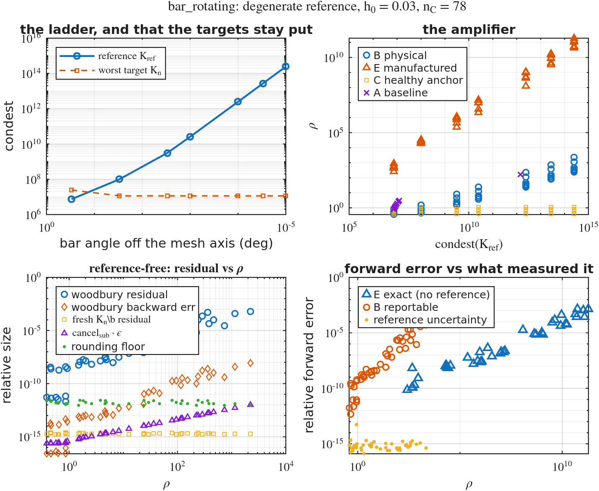
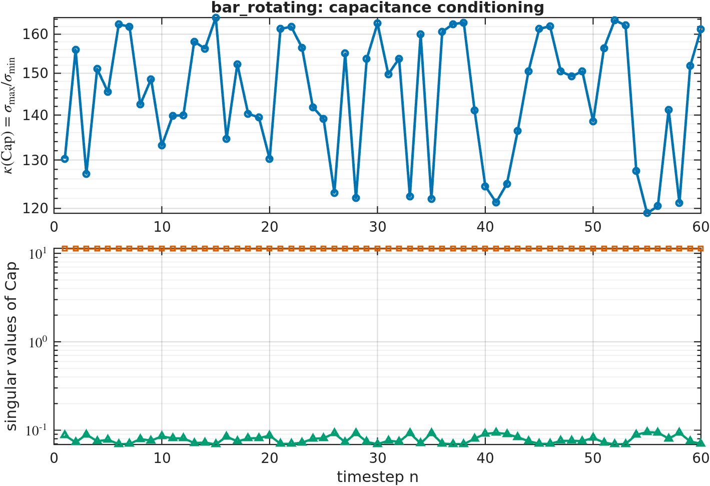
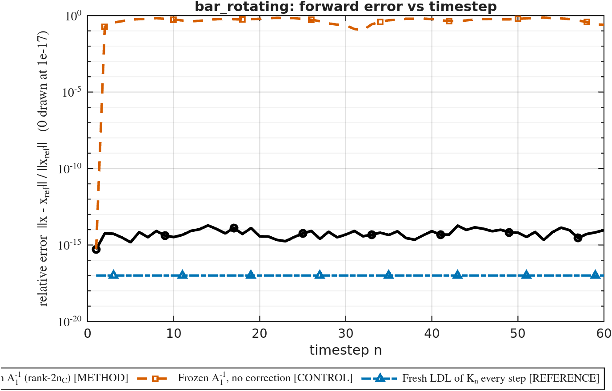
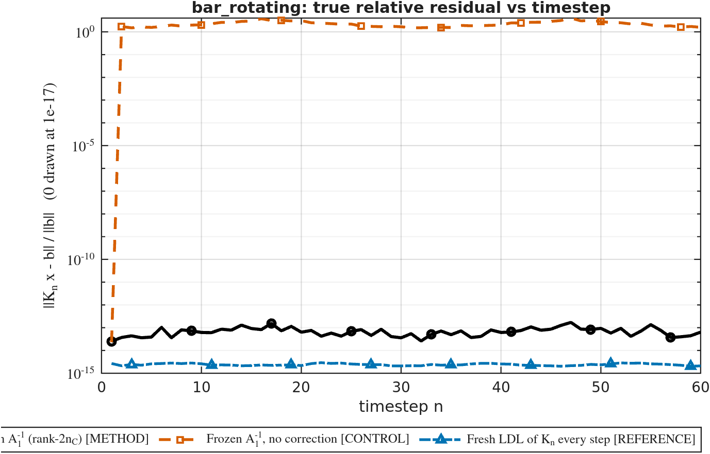
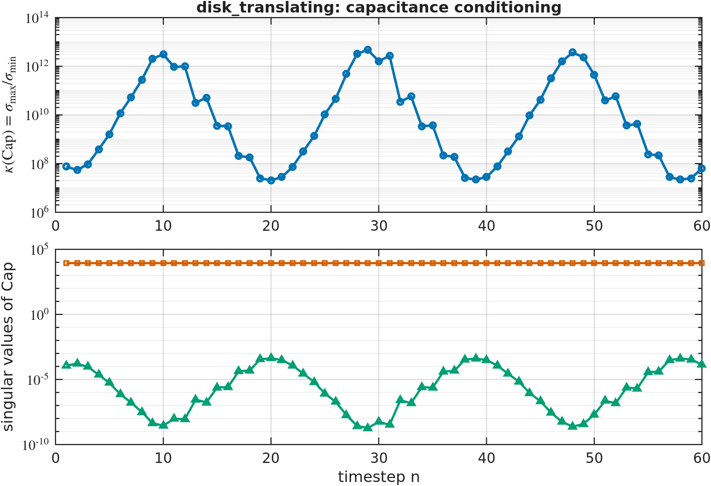
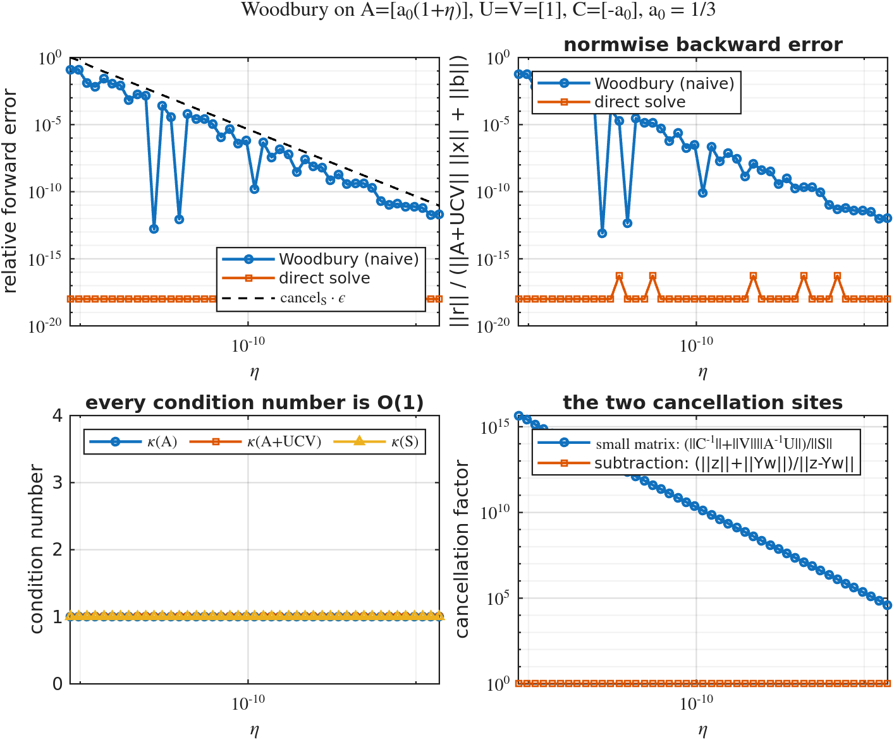

# One frozen factorization for a moving-body KKT sequence: when the update is exact, and when it is not

**It reproduces a fresh direct solve wherever both ends of the update are well posed — and on the
shipped geometry, one step is not.**

Over 60 timesteps the Woodbury update on a single frozen $\mathrm{LDL}^\top$ factorization of
$K_1$ tracks a fresh direct solve to $6.1\times10^{-13}$ (`bar_rotating`, final step) while the
*same* frozen factorization used **without** the correction is up to 100 % wrong. But the run
contains one step where that is not the whole story. At `bar_rotating` step 10 the rotor bar turns
parallel to a mesh axis, its 39 Lagrange points sample a line crossing only ~28 triangles, and the
coupling block loses rank: $\mathrm{condest}(K_{10}) = 1.4\times10^{12}$ against $\sim10^7$ at
every other step, $\kappa(\mathrm{Cap}) = 2.5\times10^{15}$, and the forward error rises to
$3.7\times10^{-6}$.

That step is **not** a Woodbury failure — its backward error is $3.9\times10^{-18}$, and the
forward error sits at $1.2\ \%$ of what $\kappa(K_{10})\varepsilon = 3.1\times10^{-4}$ permits.
The update is faithfully reporting that the *problem* is near-singular there.

Woodbury fails somewhere else, and §3 finds it: when the **frozen reference** is the ill-conditioned
end while the target stays well posed. A 7-rung ladder drives
$\mathrm{condest}(K_{\mathrm{ref}})$ from $7.4\times10^6$ to $2.4\times10^{14}$ at fixed
$n_C = 78$, holding every target below $2.4\times10^7$. There the residual climbs from
$6.7\times10^{-12}$ to $5.9\times10^{-4}$ while a fresh solve of the same systems never leaves
$2.3\times10^{-15}$ — and the **backward** error climbs with it, $8.3\times10^{-17}$ to
$8.6\times10^{-9}$, so backward stability is genuinely lost. A control arm that holds geometry,
targets and right-hand sides fixed and moves *only* the anchor stays flat at $1.4\times10^{-12}$.

> **A bad target and a bad reference are opposite phenomena.** At a bad target $\rho$ *falls*
> (to $5.4\times10^{-3}$ at step 10) and backward stability holds. At a bad reference $\rho$
> *rises* (to $2.2\times10^{3}$) and backward stability fails. The governing quantity is the
> conditioning of the matrix you **froze**, not of the one you are solving.

### What changed since the previous revision

- The narrated mesh was $h_0 = 0.05$, $n = 5840/5864$, $n_C = 20/44$. **The committed run is
  $h_0 = 0.03$, $n_{\mathrm{tot}} = 15759/16021$, $n_C = 78/340$**; the older CSVs were never in
  the repository.
- "$\kappa(\mathrm{Cap})$ stays between $1.2\times10^2$ and $4.0\times10^2$" and "the capacitance
  never becomes the problem" are **withdrawn**: the measured range on `bar_rotating` alone is
  $1.1\times10^7$ to $2.5\times10^{15}$.
- "$\rho \in [0.50, 1.01]$, the bad regime is not reached" is **withdrawn**: it is reached, by the
  geometry, at step 10.
- "Chaining updates does not compound" is **retracted** — see §8.
- **All cost claims are removed, not corrected** — see §14.

---

## 1. What is being exploited

The immersed-rotor KKT sequence moves only in its coupling block, and the sequence kernel
establishes — and re-asserts at every step of every run — that this makes the whole sequence a
**rank-$2n_C$ symmetric update of one fixed matrix**:

$$K_n = K_r + U B U^\top, \qquad U = [\,dC,\ \mathrm{Sel}\,], \quad dC = \mathrm{Cblk}_n - \mathrm{Cblk}_r, \quad B = \begin{bmatrix} 0 & I \\ I & 0\end{bmatrix}$$

with $\mathrm{Sel} = [0;0;I_{n_C}]$ selecting the multiplier rows and $B^{-1} = B$. This holds for
*any* pair of steps $n, r$, not only $r = 1$. So Woodbury applies directly, with
$Y_0 = K_r^{-1}U = [\,Y_{dC},\ Y_{\mathrm{Sel}}\,]$:

$$\mathrm{Cap} = B + U^\top Y_0, \qquad x = K_r^{-1}b \;-\; Y_0\left(\mathrm{Cap}^{-1} U^\top K_r^{-1} b\right)$$

$\mathrm{Cap}$ is $2n_C \times 2n_C$ — $156\times156$ for the bar, $680\times680$ for the disks —
and symmetric in exact arithmetic, though it is *not* symmetrized in code (§7). The identity is
**exact in exact arithmetic**: not a preconditioner, not an approximation. What it is exposed to
in floating point is cancellation, at the two sites §7 isolates. $\kappa(\mathrm{Cap})$ and both
cancellation factors are reported next to every solve.

This closes a loop the repo left open: `lowrank_update_basis.m` computes `rcond_capacitance` and
`woodbury_relerr` and says in its own docstring that they exist as diagnostics "for a downstream
Woodbury **SOLVE**". This study *is* that downstream use, and `tests/test_capacitance.m` T4 checks
that the two agree — they match to all printed digits.

## 2. Why $n_C$ backsolves and not $2n_C$

$\mathrm{Sel}$ is time-independent, so $Y_{\mathrm{Sel}} = K_r^{-1}\mathrm{Sel}$ is constant and is
solved **once**, in `woodbury_context_init`. Per step only the $dC$ half is rebuilt: $n_C$
backsolves plus one for the right-hand side, all batched into a single apply.
`test_woodbury_identity` T5 and `test_context_reuse` T4 pin this, and `test_reference_index` R7
pins that the count does not depend on which step is frozen.

Stated as an operation count, one step of the update costs $n_C + 1$ batched backsolves against
the frozen factors, an $O(n_C^2 n)$ dense product to form $U^\top Y_0$, and an $O(n_C^3)$ dense
solve for $\mathrm{Cap}$. That is the whole cost statement this study makes; §14 says why there is
no comparison attached to it.

The saving is in **backsolves**, and it changes no arithmetic — the same frozen factors are applied
to the same columns either way.

---

## 3. The governing variable: the conditioning of the frozen reference

### 3.1 The mechanism, measured rather than assumed

An earlier version of this experiment (`run_woodbury_near_wall`) asserted that the bar tips
reaching the Dirichlet walls was the cause, swept the bar half-length from $0.35H$ to $0.499H$,
and produced **zero usable points**: five rungs died in `woodbury_context_init`, two in
`build_stokes_sequence`, one in `assert_coupling_feasible`. Its own control refuted its story — at
$L_b = 0.35H$ the tips sit $5h_0$ from the wall.

The real mechanism is **collinearity**:

- the bar carries $n_b = 39$ points along a straight line;
- that line crosses 35–39 triangles at a generic angle, but only **24–29** when it is parallel to
  a mesh axis;
- 39 samples of a function that is piecewise linear on ~28 segments are not independent, so
  $W(:,\mathrm{free})$ — and with it $C$, and with it $K$ — loses rank.

Measured at $h_0 = 0.03$: $\sigma_{\min}/\sigma_{\max}$ of $W(:,\mathrm{free})$ is
$2.6\times10^{-2}$ at a generic angle and $2.5\times10^{-12}$ at 0°, 90° and 180°, with row
1-norms pinned at $1.0$ everywhere (no wall starvation) and the null vector spread across all
rows. Removing points recovers it monotonically — $n_b = 39 \to 1.0\times10^{-13}$,
$30 \to 2.6\times10^{-5}$, $24 \to 3.3\times10^{-1}$, where $n_b$ finally matches the triangles
crossed.

Wall starvation is real but is a **different** mechanism: only at $L_b = 0.499H$ does the minimum
row 1-norm fall to $0.038$, with 99.7 % of the null vector on the two tip rows. The old header
conflated the two. This study drives only the first, at the shipped $L_b = 0.35H$, so $n_C = 78$
stays comparable with the benchmark.

**Why the ladder is off *horizontal*.** Off vertical, $\mathrm{condest}(K)$ is a step function —
$\sim10^7$ for $|\delta| \ge 0.8°$ and $\sim10^{25}$ below, with nothing between. Off horizontal it
is smooth and spans the whole range at fixed $n_C$:

| $\delta$ (deg) | 0.3 | 0.03 | 0.003 | $10^{-3}$ | $10^{-4}$ | $3\times10^{-5}$ | $10^{-5}$ | 0 |
|---|---|---|---|---|---|---|---|---|
| $\mathrm{condest}(K)$ | 7.4e6 | 1.2e8 | 3.1e9 | 2.5e10 | 2.5e12 | 2.7e13 | 2.4e14 | 3.8e24 |

**The ladder is measured, not calibrated.** `generateMesh` is not stable across MATLAB releases, so
$\delta \mapsto \mathrm{cond}$ is machine-specific. Rather than bisect at run time to hit nominal
rungs, the sweep uses a fixed $\delta$ ladder and *reports the measured*
$\mathrm{condest}(K_{\mathrm{ref}})$ as the abscissa. A different mesh slides the points along that
axis, which is honest; a calibrated $\delta$ would hide the shift inside a label.

### 3.2 The ladder

`run_woodbury_bad_reference`, arm B: the degenerate step is frozen as the reference
($\mathrm{ref} = 1$) and the physical right-hand side is used. Every target is screened on
**measured** $\mathrm{condest}(K_n) < 10^8$ and none exceeds $2.44\times10^7$, so the anchor/target
separation reaches $10^7$.

| $\mathrm{condest}(K_\mathrm{ref})$ | $\rho$ | $\mathrm{cancel}_\mathrm{sub}$ | residual | backward err | fresh residual | forward err | ref. uncertainty |
|---|---|---|---|---|---|---|---|
| 7.396e6 | 0.866 | 1.36 | 6.705e-12 | 8.314e-17 | 2.518e-15 | 9.341e-12 | 5.565e-14 |
| 9.924e7 | 1.494 | 2.73 | 5.338e-09 | 7.849e-14 | 2.433e-15 | 6.439e-10 | 2.142e-15 |
| 3.094e9 | 8.312 | 16.6 | 3.135e-08 | 4.610e-13 | 2.322e-15 | 4.979e-09 | 2.055e-15 |
| 2.549e10 | 23.71 | 47.4 | 8.189e-08 | 1.204e-12 | 2.219e-15 | 1.510e-08 | 1.571e-15 |
| 2.452e12 | 222.4 | 445 | 7.221e-06 | 1.003e-10 | 2.149e-15 | 4.154e-07 | 9.564e-16 |
| 2.717e13 | 740.6 | 1481 | 6.691e-05 | 4.270e-10 | 2.213e-15 | 3.413e-06 | 1.636e-15 |
| 2.443e14 | 2221 | 4442 | 5.869e-04 | 8.629e-09 | 2.332e-15 | 5.243e-05 | 1.781e-15 |

The fresh-solve column is the control that matters: it does not move. The same seven systems,
solved directly, hold their residual at $2.3\times10^{-15}$ throughout.



### 3.3 The control that makes the ladder mean something

Arm C freezes a **healthy** step of the *same* sequence — same geometry, same targets, same
right-hand sides — and changes nothing else:

| $\mathrm{condest}(K_\mathrm{ref})$ | 7.396e6 | 9.924e7 | 3.094e9 | 2.549e10 | 2.452e12 | 2.717e13 | 2.443e14 |
|---|---|---|---|---|---|---|---|
| $\rho$, arm C | 0.993 | 1.102 | 1.102 | 1.102 | 1.101 | 1.101 | 1.101 |
| residual, arm C | 3.322e-12 | 3.167e-12 | 1.627e-12 | 1.373e-12 | 2.010e-12 | 2.615e-12 | 1.372e-12 |

Flat across the entire ladder. This also rules out the alternative reading that the *stressed mesh*
is what degrades the solves — arm C runs on exactly that mesh. The only thing that moved is the
anchor.

### 3.4 The exact arm, and which scale governs

Arm E manufactures $b = K_n x_{\mathrm{true}}$ from a known $x_{\mathrm{true}}$, so its error needs
no reference at all. Two directions are tried per target — a random one, and the reference's
near-null direction — and the worse is kept. **Arm E is adversarial at every rung** ($\rho$ starts
at 882, not at 1), so it is not row-comparable with arm B.

| $\mathrm{condest}(K_\mathrm{ref})$ | $\rho$ | Woodbury err (exact) | fresh err (exact) | $\mathrm{cancel}_\mathrm{sub}\varepsilon$ | ratio |
|---|---|---|---|---|---|
| 7.396e6 | 8.824e2 | 7.020e-09 | 1.175e-12 | 3.919e-13 | 1.79e4 |
| 9.924e7 | 3.392e4 | 1.218e-08 | 4.340e-14 | 1.506e-11 | 8.09e2 |
| 3.094e9 | 1.144e6 | 1.791e-07 | 4.183e-14 | 5.082e-10 | 3.52e2 |
| 2.549e10 | 1.536e7 | 4.557e-07 | 5.145e-14 | 6.823e-09 | 6.68e1 |
| 2.452e12 | 1.130e9 | 1.857e-05 | 4.605e-14 | 5.018e-07 | 3.70e1 |
| 2.717e13 | 1.730e10 | 4.063e-04 | 4.652e-14 | 7.681e-06 | 5.29e1 |
| 2.443e14 | 1.921e11 | 1.454e-03 | 7.787e-14 | 8.532e-05 | 1.70e1 |

At the top rung, ranked against the three candidate scales:

| scale | value | err / scale |
|---|---|---|
| $\mathrm{cancel}_{\mathrm{sub}}\,\varepsilon$ — cancellation site 2 | 8.532e-05 | **17.0** |
| $\mathrm{condest}(K_{\mathrm{ref}})\,\varepsilon$ — a degenerate reference | 5.424e-02 | 2.68e-2 |
| $\mathrm{condest}(K_n)\,\varepsilon$ — the target's own conditioning | 2.540e-09 | 5.72e5 |

**Cancellation site 2 is excited** — the site the previous revision recorded as never reached.
Two claims only: a *ranking* (site 2 is closest; the other two miss by 1.6 and 5.8 decades) and a
*trend* (the last column falls three decades as the site is driven). The ratios run
$1.8\times10^4 \to 17$, so this is not a scaling law and no exponent is claimed.

### 3.5 The same event as a bad *target*: benchmark step 10

$\mathrm{Cap}$ is singular iff $K_n$ is (given $K_{\mathrm{ref}}$ nonsingular). So the collinearity
event has a second face: frozen *at* that step it is a bad anchor, solved *at* that step it is a bad
target. Both are in the repository already.

Sweeping the anchor over all 15 steps of the shipped ($\theta_0 = 0$) sequence:

| | 14 of 15 anchors | **anchor = step 10** |
|---|---|---|
| $\mathrm{condest}(K_{\mathrm{ref}})$ | 7.5e6 – 1.25e7 | **1.408e12** |
| $\rho$ | 0.786 – 3.10 | **167** |
| residual | $\sim10^{-12}$ | **4.466e-06** |

Step 10 sits at **118.03° — 28° from any mesh axis**. No geometric rule predicts it; only
measurement finds it. *The shipped geometry already contains a bad anchor, and the default
`ref = 1` merely got lucky.*

Read from the other side, in the committed 60-step benchmark at the same step:

| quantity | value |
|---|---|
| $\kappa(\mathrm{Cap})$ | 2.469869e+15 |
| $\sigma_{\min}(\mathrm{Cap})$ | 7.868213e-12 |
| forward error | 3.746197e-06 |
| Woodbury relative residual | 5.746003e-11 |
| backslash relative residual | 1.261881e-12 |
| **residual ratio** | **45.5×** |
| backward error | 3.884e-18 |





**What may and may not be concluded from step 10.** The forward error of $3.7\times10^{-6}$ is
*not* evidence that Woodbury degraded: $\kappa(K_{10})\varepsilon = 3.1\times10^{-4}$, so the error
is at 1.2 % of what the target's own conditioning permits, the backward error is
$3.9\times10^{-18}$, and `fresh_err = 0` is a tautology (§6). What *is* evidence is the
reference-free residual ratio — 45.5× at step 10, and 677× at its worst step (§5).

**This indicts the discretization, not the solver.** 39 points sampling a function that is
piecewise linear on ~28 segments is over-sampling; $n_b \to 24$ restores
$\sigma_{\min}/\sigma_{\max}$ to $0.33$. Step 10 is measuring a defective immersed-boundary
discretization, and the update is faithfully reporting that the problem is near-singular there.
The run of record will **not** be regenerated to hide it: step 10 stays in, flagged.

### 3.6 What a user should therefore watch

`woodbury_context_init` reports three quantities on every successful call, at no extra
factorization:

- `ctx.apply_relres` $= \lVert K_{\mathrm{ref}} Y_{\mathrm{Sel}} - \mathrm{Sel}\rVert_F / \lVert \mathrm{Sel}\rVert_F$.
  This is the best free proxy: across the ladder it runs 2.594e-11 → 1.344e-3, monotone in the
  reference's conditioning. It underestimates
  $\mathrm{condest}(K_{\mathrm{ref}})\varepsilon$ by a factor of 5–75 over the seven rungs, so it
  is a usable indicator, not an estimator.
- `ctx.rcond_D` $= 1/\mathrm{condest}(D)$ — monotone in the reference's conditioning but a loose
  bound (it underestimates by several decades).
- `ctx.cond_ref` $= \mathrm{condest}(K_{\mathrm{ref}})$, populated only when the gate had to look
  (§11), because it costs an extra sparse LU.

A reference with `apply_relres` above $\sim10^{-9}$ is worth re-anchoring away from. **Automatic
re-anchoring is not implemented**, deliberately, on the same grounds as the absent iterative
refinement: either would make the reported accuracy the repair's rather than the problem's.

---

## 4. Ground truth: how these numbers were earned

Stressing the operator degrades the reference too, so "Woodbury is wrong by $10^{-12}$" is
worthless if $K_n \backslash b$ is also wrong by $10^{-12}$. **Nothing here is computed in exact or
extended-precision arithmetic** — there is no Symbolic Toolbox on this machine, and
`dd_woodbury_scalar` is scalar-only and cannot referee the block problem. Three independent
ladders replace it:

1. **Reference-free metrics.** The relative residual and the normwise backward error need no true
   solution at all. These carry the headline in §3.2 and §5, and they are unassailable.
2. **A measured uncertainty on every forward error.** One step of fixed-precision iterative
   refinement on $K_n$ gives `ref_unc` ($\sim10^{-15}$ across the ladder), and every forward error
   is printed through `woodbury_mask_error`, which flags with `~` anything not $10\times$ clear of
   it. This is the standard LAPACK-style heuristic and **not a bound** — see the caveat below.
   Pinned by `test_mask_error` (7 assertions).
3. **A manufactured right-hand side.** Arm E's $x_{\mathrm{true}}$ is exact, though
   $b = K_n x_{\mathrm{true}}$ is a rounded matvec, so a gap remains — and that gap is *measured*
   by the fresh-error column, $4.3\times10^{-14}$ to $1.2\times10^{-12}$. Against Woodbury errors
   of $7\times10^{-9}$ to $1.5\times10^{-3}$ that is $\ge 3.7$ decades of headroom at every rung.

**The caveat, stated before it is asked for.** Fixed-precision refinement drives the *backward*
error to $O(\varepsilon)$ but does not bound the forward error below $\kappa(K_n)\varepsilon
\approx 2.5\times10^{-9}$. Under that rigorous bound rather than the heuristic, the ratios
`forward_err`/$(\kappa(K_n)\varepsilon)$ across the ladder are

$$0.002,\quad 0.25,\quad 2.0,\quad 5.9,\quad 163,\quad 1340,\quad 20600$$

so only the **top three rungs'** forward errors are certified. The headline residual and
backward-error argument does not depend on any of this.

---

## 5. The committed run of record

`woodbury_direct/` holds the 3-case, 60-step benchmark at $h_0 = 0.03$, $dt = 0.02$,
$T_{\mathrm{step}} = 61$, `use_cache = false`, `verify_lowrank = true`, `TIME_REPEATS = 3`
(`run_config.json`). These CSVs are **frozen** and are not regenerated by this document.

| case | $n_{\mathrm{tot}}$ | $n_C$ | $\mathrm{nnz}(K_1)$ | $\mathrm{nnz}(L)$ | fill | $\max\,dC_{\mathrm{rel}}$ |
|---|---|---|---|---|---|---|
| `bar_rotating` | 15759 | 78 | 234405 | 1299662 | 5.54 | 1.392 |
| `disk_translating` | 16021 | 340 | 235977 | 1300325 | 5.51 | 1.418 |
| `disk_static` | 16021 | 340 | 235977 | 1296600 | 5.49 | 0 |

Accuracy, and the reference-free ratio that is the honest headline:

| case | Woodbury err mean / max | frozen err mean / max | max $\kappa(\mathrm{Cap})$ | **max residual ratio** |
|---|---|---|---|---|
| `bar_rotating` | 6.28e-08 / 3.75e-06 | 0.534 / 1.000 | 2.470e+15 (step 10) | **677× (step 17)** |
| `disk_translating` | 8.70e-10 / 1.67e-08 | 0.860 / 0.993 | 4.695e+12 (step 29) | **9531× (step 16)** |
| `disk_static` | 1.03e-15 / 2.39e-15 | 1.03e-15 / 2.26e-15 | 9.172e+08 (constant) | 14.1× (step 24) |

The residual ratio is $\lVert K_n x_{\mathrm{wood}} - b\rVert / \lVert K_n x_{\mathrm{bslash}} - b\rVert$,
derived from the committed columns. Medians are 358×, 3014× and 7.5×; minima 28×, 138× and 6.4×.
Note that the worst ratio is **not** at the $\kappa(\mathrm{Cap})$ spike — 677× lands at step 17,
not step 10 — so the capacitance is not the whole story even here.




`disk_translating` carries a second, independent instance of the spike: $\kappa(\mathrm{Cap})$
reaches $4.7\times10^{12}$ at step 29 with $\sigma_{\min} = 1.8\times10^{-9}$.



Drift from the frozen reference:


The sharp dip at step 31 is not noise. The rotor turns twice over
$T_{\max} = dt\cdot T_{\mathrm{step}}$, so one revolution takes ~30.5 steps and at step 31 the bar
has returned to (a permutation of) its step-1 configuration — independently reproducing the
$\pi$-symmetry the parent's `extract_kkt_examples.m` documents. The Woodbury correction's magnitude
tracks it.

---

## 6. The three arms, and the control that makes them mean something

| key | what it computes | role |
|---|---|---|
| `woodbury` | frozen $\mathrm{LDL}$ of $K_1$ + the rank-$2n_C$ correction | **the method** |
| `frozen` | $K_1^{-1}b_n$, no correction | control: what the correction buys |
| `fresh` | $K_n \backslash b_n$, refactorized each step | accuracy reference |

All three are **direct** solves — there is no Krylov layer, so quality is forward error and
iteration counts, the currency of the sibling benchmarks, do not exist here. No arm advances the
state: $u_{\mathrm{prev}}$ is advanced with the backslash solution inside `build_stokes_sequence`,
exactly as the parent benchmark does, so all three see an identical RHS sequence.

**What the error columns actually measure.** The reference is
$x_{\mathrm{ref}} = K_n \backslash b_n$, so `*_err` is *agreement with a reference direct solve*,
not distance from the exact solution. `fresh_err == 0` in every row is therefore a
**determinism check, not an accuracy check** — `fresh` runs the same algorithm as the reference, so
agreeing with it is a tautology. §4 is what replaces it, and §5's residual ratio is the column to
read instead.

`disk_static` is the falsification control. Its coupling is constant, so $dC$ is *exactly* zero,
hence $K_n = K_1$ exactly and the correction is provably zero. It is **not** skipped — the naive
path has no $dC = 0$ branch and computes and rounds it like any other step — so
`test_static_control` asserts that the correction *vanishes*, not that it was avoided. In practice
it comes out exactly zero, and structurally so: with $dC = 0$ the first block row of
$\mathrm{Cap}$ is $[\,0\ \ I\,]$ against a zero right-hand side, which forces the $\mathrm{Sel}$
half of $w$ to zero while the $dC$ half of $Y_0$ is the exact zero matrix. A scheme that works on a
moving sequence but fails this control is wired wrong.

Its $\kappa(\mathrm{Cap}) = 9.17\times10^8$, constant, is also this mesh's **capacitance baseline
with no motion at all** — the number to compare against before attributing any $\kappa(\mathrm{Cap})$
to the update (§10, §14).

---

## 7. Where the instability lives: two constructed families at $\kappa = 1$

A benign result from a method that cannot fail is not evidence. `woodbury_naive` — the same
expression, in the same order, on small dense systems — is run on two constructed families where it
loses everything. **In both, every condition number in sight is $1$.** These are not ill-posed
problems solved badly; they are well-posed problems *evaluated* badly.

§3 has now reached cancellation site 2 on the real operator, so these families are no longer "the
only place the method can fail". Their remaining and irreplaceable job is that they **separate the
two sites**, which the rotor cannot: on the physical sequence both factors move together.

Run `run_woodbury_scalar_stress`; `tests/test_stress_metrics.m` (16 assertions) holds the numbers
in place.

### The two cancellation sites

$$\mathrm{cancel}_S = \frac{\lVert C^{-1}\rVert + \lVert V\rVert\,\lVert A^{-1}U\rVert}{\lVert S\rVert}, \qquad
  \mathrm{cancel}_{\mathrm{sub}} = \frac{\lVert z\rVert + \lVert Yw\rVert}{\lVert z - Yw\rVert}$$

with $S = C^{-1} + VA^{-1}U$, $z = A^{-1}b$, $Y = A^{-1}U$. Both equal $1$ when nothing cancels.
Neither is a function of $\kappa(A)$ or $\kappa(A+UCV)$ — that is the whole point.

### Family 1 — the final subtraction

$A = [1]$, $U = V = [1]$, $C = [\alpha]$, $b = [1]$, so $x = 1/(1+\alpha)$ exactly. Woodbury
evaluates it as $1 - \alpha/(1+\alpha)$.

| $\alpha$ | Woodbury | direct | 32-digit | backward err | all $\kappa$ | $\mathrm{cancel}_S$ | $\mathrm{cancel}_{\mathrm{sub}}$ |
|---|---|---|---|---|---|---|---|
| 1e8 | 7.180e-09 | 0 | 0 | 3.590e-09 | 1 | 1 | 2.000e8 |
| 1e12 | 8.890e-05 | 0 | 0 | 4.445e-05 | 1 | 1 | 2.000e12 |
| 1e15 | 1.102e-01 | 0 | 0 | 5.223e-02 | 1 | 1 | 1.801e15 |
| **1e16** | **1.000** | **0** | **1.233e-16** | **1.000** | **1** | **1** | $\infty$ |

At $\alpha = 10^{16}$ the subtraction returns **exactly zero** while the answer is $10^{-16}$.
Three things worth separating:

- **Not a conditioning failure.** $\kappa(A) = \kappa(A+UCV) = \kappa(S) = 1$ throughout, and the
  direct solve is exact at every $\alpha$.
- **Not backward stable either.** The backward error reaches $1.0$ — the computed iterate does not
  solve *any* nearby system.
- **A precision failure, not a formula failure.** The identical expression in ~32-digit
  double-double arithmetic (`dd_woodbury_scalar`) returns $1.2\times10^{-16}$.

Across the whole sweep, $\mathrm{err} \le 0.326 \cdot \mathrm{cancel}_{\mathrm{sub}}\varepsilon$ —
predicted by the cancellation factor, never by a $\kappa$.


### Family 2 — the small matrix

Family 1 leaves $\mathrm{cancel}_S = 1$, so it says nothing about the other site. With
$a_0 = 1/3$, $A = [a_0(1+\eta)]$, $U = V = [1]$, $C = [-a_0]$: now $S = -1/a_0 + 1/A$ cancels two
numbers of size $3$ into one of size $3\eta$, and its one-ulp absolute error is an
$\varepsilon/\eta$ *relative* error.

| $\eta$ | Woodbury err | direct | all $\kappa$ | $\mathrm{cancel}_S$ | $\mathrm{cancel}_{\mathrm{sub}}$ |
|---|---|---|---|---|---|
| 5.01e-16 | **1.250e-01** | 0 | 1 | 4.504e15 | 1.000 |
| 5.01e-14 | 1.849e-03 | 0 | 1 | 3.997e13 | 1.000 |
| 5.01e-11 | 3.691e-07 | 0 | 1 | 3.991e10 | 1.000 |
| 5.01e-05 | 2.116e-12 | 0 | 1 | 3.991e04 | 1.000 |

$\mathrm{cancel}_{\mathrm{sub}}$ is exactly $1$ at every row — the final subtraction is innocent —
and the error tracks $\mathrm{cancel}_S\varepsilon$ instead (median 0.154, max 0.292, over 11
decades). **The two factors are not interchangeable diagnostics; each governs its own mechanism,
and each family isolates one.**



One implementation note that took a rebuild to find: anchoring at $a_0 = 1$ instead of $1/3$ is
*degenerate*. The true $1/(1+\eta) = 1 - \eta + \eta^2$ sits within $\eta^2$ of the representable
$1-\eta$, so $\mathrm{fl}(1/A)$ carries a rounding of $\eta^2$ rather than of $\varepsilon$ and the
mechanism never fires. Off a power of two, $1/A$ lands generically between doubles and the full ulp
is lost.

---

## 8. Does chaining compound? Yes — this is a retraction

The previous revision reported that chaining updates does **not** compound ("the ratio is flat in
depth", "depth is not the variable"). **That result does not reproduce and is withdrawn.**

`run_woodbury_recursive` builds 39 chained updates — level $k$ treats the level $k{-}1$ *operator*
as its $A^{-1}$ — and runs them against the production fixed-reference scheme on the same steps at
$h_0 = 0.1$, $n_C = 24$. The increments telescope, so both arms represent the same inverse and
every difference is floating point.

| | level 2 | level 40 | ratio recursive/fixed | operator drift, level 40 |
|---|---|---|---|---|
| recursive (39 chained) | 1.28e-14 | **5.01e-01** | median **2.05e+12**, max 2.46e+14 | 4.33e-01 |
| fixed reference | 2.34e-14 | 9.40e-14 | — | 1.08e-13 |

The ratio **grows with depth**. The chained capacitance reaches $\kappa = 1.9\times10^{22}$ and
`woodbury_solve` raises `singularCapacitance` at levels 13 and 15 (`rcond` $8.5\times10^{-24}$ and
$1.2\times10^{-23}$). On the adversarial right-hand side at level 40 the chained arm is
$3.19\times10^{2}$ against the fixed arm's $2.06\times10^{-11}$ — the *opposite* of the previous
revision's finding.


**Two honesty notes.**

- The comparison is **confounded** by the same collinearity mechanism: at $h_0 = 0.1$ the *fixed*
  arm also loses all digits at levels 13 and 15 (errors $4.48$ and $0.999$), because those steps
  are themselves near-singular targets. The defensible claim is the chained arm's **growth with
  depth** and its capacitance breakdown; the absolute error levels are contaminated.
- `run_woodbury_recursive`'s own closing paragraph is **stale template text** and now contradicts
  the numbers printed immediately above it — it prints "DEPTH IS NOT THE VARIABLE" on the same run
  whose trend line reads "GROWS with depth", and calls the chained arm "the BETTER one" while
  quoting $3.2\times10^{2}$ against $2.1\times10^{-11}$. Read the table, not the prose.
  `tests/test_recursive_growth.m` T3/T5/T6 fail accordingly (§13).

---

## 9. Why it stays benign on the healthy steps

The same instruments, on the physical 60-step sequence (`run_woodbury_stability`), with step 10
deliberately included:

| step | $\kappa(K_n)$ | $\kappa(\mathrm{Cap})$ | $\rho$ | forward err | residual | backward err | $\mathrm{cancel}_{\mathrm{cap}}$ | $\mathrm{cancel}_{\mathrm{sub}}$ |
|---|---|---|---|---|---|---|---|---|
| 2 | 7.880e6 | 3.083e8 | 0.829 | 2.654e-13 | 2.736e-13 | 2.972e-18 | 12.1 | 1.06 |
| **10** | **1.408e12** | **2.470e15** | **5.443e-03** | **3.746e-06** | **5.746e-11** | **3.884e-18** | 13.1 | 1.01 |
| 20 | 9.611e6 | 1.091e8 | 0.481 | 1.226e-12 | 8.925e-13 | 6.385e-18 | 13.0 | 1.11 |
| 31 | 7.478e6 | 4.679e8 | 1.060 | 1.840e-12 | 2.428e-13 | 3.601e-18 | 11.2 | 1.21 |
| 40 | 1.101e7 | 2.572e7 | 0.437 | 5.114e-13 | 1.060e-12 | 5.725e-18 | 12.9 | 1.05 |
| 60 | 7.534e6 | 3.621e8 | 1.061 | 6.060e-13 | 3.147e-13 | 4.720e-18 | 12.5 | 1.31 |

**Read the $\rho$ column at step 10.** It is $5.4\times10^{-3}$ — the *smallest* in the table. A
near-singular target makes $\lVert K_n^{-1}b\rVert$ large, which pushes $\rho$ *down*. This is the
cleanest statement of the asymmetry in the header: $\rho$ rises for a bad reference and falls for a
bad target, and only the first is a Woodbury problem. Backward error stays at
$\le 6.4\times10^{-18}$ at every step including 10.

Five structural reasons the healthy steps are benign, each tied to a measurement or a test:

1. **$C$ is an involution.** $C = B$, so $C^{-1} = C$ *exactly* and $\kappa(C) = 1$. The $C^{-1}$
   term of $S$ is formed with zero error, which is why $\mathrm{cancel}_{\mathrm{cap}}$ sits at
   11–13 instead of the $10^{14}$ family 2 reaches.
2. **$U$'s blocks are exactly orthogonal.** $dC$ occupies only velocity rows and $\mathrm{Sel}$
   only multiplier rows, so $\lVert dC^\top\mathrm{Sel}\rVert = 0$ exactly
   (`test_capacitance` T8).
3. **$\rho \le 1.07$ on the healthy steps**, so the final subtraction annihilates nothing
   ($\mathrm{cancel}_{\mathrm{sub}} \le 1.31$). §3 breaks this deliberately; an adversarial
   right-hand side at step 20 reaches $\rho = 8.4\times10^{3}$ and costs three digits (below).
4. **$z$ and $Y_0$ go through the same frozen factors**, so the factorization's rounding is a
   *backward* perturbation of $K_n$ rather than an amplified forward error — which is why the
   measured backward error is $\sim10^{-18}$ rather than the $1.0$ of family 1.
5. **$\mathrm{Cap}$ is nonsingular whatever $dC$'s rank**, because the identity blocks couple the
   halves: $dC\,v = 0$ still gives $\mathrm{Cap}\,[v;0] = [0;v] \ne 0$ (§10).

The sixth reason the previous revision gave — "$\mathrm{Cap}$ is bounded because every $K_n$ here
is an equally well-posed KKT system" — is **false at this mesh** and is what §3.5 replaces.

**The instability is reachable on demand, at any step.** At step 20, taking $b = K_n v$ with $v$
the leading right singular vector of $K_1^{-1}K_n$ (so $x = v$ exactly):

| RHS at step 20 | $\rho$ | Woodbury err | backslash err |
|---|---|---|---|
| the physical one | 0.481 | 1.226e-12 | — |
| adversarial | **8.375e3** | **1.845e-09** | 4.878e-14 — unmoved |

**What this does not establish:** that the error scales *as* $\kappa(\mathrm{Cap})\varepsilon$.
Neither cancellation factor brackets the observed errors here — $\mathrm{cancel}_{\mathrm{cap}}
\varepsilon \approx 2.9\times10^{-15}$ sits *below* every forward error in the table, and
$\kappa(\mathrm{Cap})\varepsilon$ sits five decades *above* the healthy ones. The six rows settle
only that the governing scale is not $\kappa(K_n)\varepsilon$. (`run_woodbury_stability`'s own
generated summary claims $\mathrm{cancel}_{\mathrm{cap}}\varepsilon$ "brackets the observed
errors"; it does not, and that sentence is stale — see §13.)

---

## 10. Why $U$ is NOT orthogonalized

The reflex for low-rank updates is to orthogonalize the factors (the kernel's
`lowrank_update_basis` does exactly that — but there only the *span* matters, so it is free). Here
it is measured to be actively harmful. Three reasons:

**(a) $U$'s two blocks are already exactly orthogonal.** $dC = [\,C_u;0;0\,]$ occupies only the
velocity rows and $\mathrm{Sel} = [\,0;0;I\,]$ only the multiplier rows — disjoint support, so
$\lVert dC^\top\mathrm{Sel}\rVert = 0$ *exactly* at every step. There is nothing to normalize.

**(b) $\rho$ is basis-independent.** It involves only $b$, $K_1$ and $K_n$ — not $U$ — so no
reparametrization of $U$ can touch the dominant error term.

**(c) It forfeits a robustness the current form has, and at this mesh it fails outright.**
Orthogonalizing $dC = Q_d R_d$ makes the middle matrix
$\tilde B = \begin{bmatrix}0 & R_d\\ R_d^\top & 0\end{bmatrix}$, whose inverse requires
$R_d^{-1}$. The current $B$ **is** its own inverse ($\kappa(B)=1$) and is never inverted. Measured
at $h_0 = 0.03$ over the six probe steps, $\kappa(R_d)$ runs $1.7\times10^{17}$ to
$3.3\times10^{17}$ and the orthogonalized capacitance is **singular to working precision at every
step** — its error column is `NaN` throughout, including on the adversarial right-hand side where
the original returns $1.8\times10^{-9}$.

The rank-deficiency guard, restated with current numbers: forcing a duplicate column into $dC$
gives $\kappa(\mathrm{Cap}) = 1.084\times10^{8}$ against $\kappa(R_d) = 1.0\times10^{17}$ for the
orthogonalized alternative. Note that $1.08\times10^{8}$ is *below* this mesh's healthy baseline —
$\kappa(\mathrm{Cap})$ is $3.78\times10^{8}$ at bar step 1 (where $dC \equiv 0$) and
$9.17\times10^{8}$ for all of `disk_static`. **Rank deficiency in $dC$ costs nothing measurable at
$h_0 = 0.03$**; the structural claim is confirmed, and only `test_capacitance` T9a's threshold is
mesh-stale (§13).

Orthogonalization *would* matter if the factors were badly scaled or nearly dependent, or if
updates **accumulated**. The second of those is now a live concern — see §8 — but it is an argument
against chaining, not for orthogonalizing.

---

## 11. Layout and provenance

| file | role |
|---|---|
| `add_woodbury_paths.m` | path bootstrap; documents the shadowing hazard below |
| `assert_woodbury_helpers.m` | anti-shadowing guard; pins `define_motion_list` to the sibling |
| `make_woodbury_params.m` | all knobs, each with its reason |
| `woodbury_context_init.m` | **the one factorization**; optional `REF` selects which step is frozen; reports `rcond_D`, `cond_ref`, `apply_relres` |
| `woodbury_apply_ref.m` | applies $K_{\mathrm{ref}}^{-1}$ by hand — the factors are stored raw rather than as a `decomposition` object because `decomposition` does not batch across columns |
| `woodbury_solve.m` | the per-step solve, **naive by design** (§7) + cancellation diagnostics |
| `woodbury_mask_error.m` | the rule for which forward errors are reportable (§4) |
| `woodbury_naive.m` | the same identity on small dense $(A,U,C,V,b)$ |
| `dd_woodbury_scalar.m` | ~32-digit double-double evaluation; **scalar only** |
| `woodbury_chain_build.m`, `woodbury_chain_apply.m` | the chained scheme §8 retracts |
| `solve_woodbury_sequence.m` | engine: one case, three arms, `Astat` |
| `run_woodbury_benchmark.m` | driver: all cases → CSVs → figures |
| `run_woodbury_bad_reference.m` | reproduces §3 (was `run_woodbury_near_wall`; the rename came with a mechanism correction, not a refactor) |
| `run_woodbury_stability.m` | reproduces §9 |
| `run_woodbury_scalar_stress.m` | reproduces §7 |
| `run_woodbury_recursive.m` | reproduces §8 |
| `write_woodbury_outputs.m`, `write_woodbury_figures.m`, `replot_woodbury.m` | CSVs, figures from CSVs only, redraw without re-solving |
| `woodbury_fig_defaults.m`, `save_woodbury_figure.m`, `woodbury_style_table.m` | figure style (renamed local copies) |
| `tests/run_all_tests.m` + 10 scripts | 105 assertions, ~21 s — **2 currently fail**, see §13 |
| `woodbury_direct/` | the committed run: 3 CSVs + 20 figures |

Reused rather than copied: `define_motion_list.m` from the sibling benchmark by path, and
`build_stokes_sequence` / `seq_K` / `seq_dCblk` from `../linear_solves/subspace_recycle/kernel/`.
Nothing was added to `+src`.

### Provenance: what each section's numbers came from

| section | source | frozen or re-runnable |
|---|---|---|
| §3 | `run_woodbury_bad_reference` (h0 = 0.03, 15 steps) | re-runnable |
| §5 | `woodbury_direct/*.csv` + `run_config.json` | **frozen**, not regenerated |
| §5 residual ratio | derived from the committed columns | derived |
| §7 | `run_woodbury_scalar_stress` | re-runnable, mesh-independent |
| §8 | `run_woodbury_recursive` (h0 = 0.1, 40 levels) | re-runnable |
| §9, §10 | `run_woodbury_stability` (h0 = 0.03, 60 steps) | re-runnable |
| §13 | `tests/run_all_tests` | re-runnable |

Mesh generation is **not** reproducible across MATLAB releases (`generateMesh` is not
release-stable), so every conditioning number here is machine-specific in absolute value. That is
why §3's abscissa is a measured $\mathrm{condest}$ rather than a geometric parameter.

### The CSVs are the contract

`write_woodbury_figures` reads only `<case>_results.csv` and `woodbury_summary.csv`, never an
`Astat`, so adding a figure that needs a new quantity means adding the column first —
`test_engine_smoke` T5c enforces exactly that.

### The applier gate, and why §3 was unreachable before it

`woodbury_context_init` checks that the applier really inverts the reference, by measuring
$\mathrm{relres} = \lVert K_{\mathrm{ref}}Y_{\mathrm{Sel}} - \mathrm{Sel}\rVert_F /
\lVert \mathrm{Sel}\rVert_F$. The threshold used to be a fixed $10^{-8}$ — but relres is bounded
below by $\kappa(K_{\mathrm{ref}})\varepsilon$ no matter how correct the applier is, so that fixed
number was in truth the assertion $\kappa(K_{\mathrm{ref}}) < 4.5\times10^{7}$, and it reported
everything worse as *"the ldl permutation/scaling convention has changed"*. **Five of §3's seven
rungs were unreachable until that diagnostic stopped lying.** It now refuses a genuinely singular
reference first ($1/\mathrm{condest}(K_{\mathrm{ref}}) < \varepsilon$), then compares relres
against $\min(1,\ \max(10^{-8},\ 50\,\mathrm{condest}(K_{\mathrm{ref}})\varepsilon))$ — a wrong
permutation still gives relres $\gg 1$ (measured 20 to 790), so the wiring check survives the
loosening. `test_reference_index` R9 pins that an ill-conditioned but invertible reference is
accepted *and* that the loosened branch is actually exercised.

One further implementation note: `condest` estimates $\lVert A^{-1}\rVert_1$ with `normest1`, which
**draws from the global random stream**. Every `condest` call in this study is wrapped to save and
restore the RNG state — without that, a context init silently shifts the random stream for
everything downstream, which broke two `rng(0)`-seeded tests.

### Why every local helper is renamed

The Schur twin copies `save_benchmark_figure` / `benchmark_fig_defaults` / `solver_style_table`
under their **original** names and relies on `addpath('-begin')` to win over the sibling folder's
copies. That ordering cannot be relied on here: `build_stokes_sequence` calls `add_recycle_paths()`
internally, which **prepends** the sibling rotor directory *mid-run*, after our `-begin`. Rather
than fight for path position, every helper here carries a `woodbury_` / `_woodbury` name — including
`assert_woodbury_helpers`, so the guard cannot itself be shadowed.

---

## 12. Running

```matlab
% unit gate (~21 s; currently 8/10 scripts pass -- see section 13)
cd tests; run_all_tests

% smoke run: h0 = 0.1, 5 steps -> woodbury_direct_smoke/
SMOKE_TEST = true; run_woodbury_benchmark

% the committed benchmark: 3 cases x 60 steps at h0 = 0.03
clear SMOKE_TEST; run_woodbury_benchmark

% redraw figures from the committed CSVs, solving nothing
replot_woodbury

% the stability studies -- none of these write CSVs
run_woodbury_bad_reference     % section 3: the degenerate-reference ladder
run_woodbury_stability         % section 9: which scale governs on the real sequence
run_woodbury_scalar_stress     % section 7: break the identity at kappa = 1  (< 1 s)
run_woodbury_recursive         % section 8: 39 chained updates vs a fixed reference

SMOKE = true; run_woodbury_bad_reference   % plumbing only -- see below
```

`SMOKE_TEST` trims `max_steps`, **not** $T_{\mathrm{step}}$: $T_{\mathrm{step}}$ sets $T_{\max}$ and
hence the rotor's angular velocity, so shrinking it would change the geometry under test rather
than just doing fewer solves.

`SMOKE = true; run_woodbury_bad_reference` is a **plumbing test, not a ladder.** The collapse width
scales with $h_0/L_b$, so the $h_0 = 0.03$ ladder does not transfer: at $h_0 = 0.1$ the measured
progression is 10° $\to 7.0\times10^5$, 5° $\to 2.7\times10^7$, 3° $\to 3.4\times10^{30}$ — a cliff
with no usable band. Its third rung sits on the cliff deliberately, to exercise the
infeasible-rung reporting path.

---

## 13. The test suite, including two assertions that currently fail

`run_all_tests` runs 10 scripts / 105 assertions in ~21 s, in dependency order:

| script | assertions | what it pins |
|---|---|---|
| `test_mask_error` | 7 | which forward errors are reportable (§4) |
| `test_woodbury_identity` | 7 | the gate: the update reproduces $K_n \backslash b$ |
| `test_capacitance` | 14 | $\mathrm{Cap}$'s structure, and the rank-deficiency guard |
| `test_static_control` | 5 | the falsification control |
| `test_context_reuse` | 12 | one factorization, statelessness, order independence |
| `test_reference_index` | 13 | exactness at any anchor; the cost invariant; the rescaled gate |
| `test_stress_metrics` | 16 | the two constructed families (§7) |
| `test_woodbury_naive` | 11 | the kernel that fails there is this one |
| `test_recursive_growth` | 7 | chaining behaviour (§8) |
| `test_engine_smoke` | 13 | plumbing, CSV contract, figures |

**Two scripts fail on the current tree**, both pre-existing and both pinning claims this revision
has had to change. They are documented rather than repaired, because the correct repair is a
judgement about the fixtures, not about the code under test.

- **`test_capacitance` T9a** — asserts $\kappa(\mathrm{Cap}) < 10^6$ for a rank-deficient $dC$;
  measures $1.084\times10^{8}$. This is a **stale threshold**, not a regression: $10^{8}$ is below
  this mesh's no-motion baseline of $3.78\times10^{8}$ (§10), so rank deficiency still costs
  nothing. The threshold was calibrated against a mesh whose baseline was $\sim3\times10^{2}$.
- **`test_recursive_growth` T3, T5, T6** — T3 asserts both arms accurate to $10^{-12}$ (measures
  recursive $3.60\times10^{-12}$); T5 asserts the error does not grow with depth (measures a slope
  of $0.1523$ per level against a $0.05$ limit); T6 asserts comparable operator drift. These are
  **not** stale thresholds — they are the compounding signal §8 documents.

Two generated summary paragraphs are also stale and contradict the numbers printed above them:
`run_woodbury_recursive`'s "DEPTH IS NOT THE VARIABLE" (§8) and `run_woodbury_stability`'s claim
that $\mathrm{cancel}_{\mathrm{cap}}\varepsilon$ brackets the observed errors (§9). Both are
template text that predates the current measurements. Read the tables.

---

## 14. Limits, and what this does not claim

- **No cost claim is made.** Wall-clock timings, per-step speedups and break-even steps are
  properties of an implementation — of MATLAB's sparse `ldl`, of how well triangular solves batch,
  of one machine — not of the identity. Earlier revisions of this README reported such ratios as
  results; they have been removed rather than corrected. The only cost statement retained is the
  operation count in §2, with no comparison attached. The CSVs still carry timing columns; they are
  not read here.
- **The reference is frozen at one step, with no refresh knob**, by design — a cadence parameter
  would let "can one factorization serve the sequence?" be answered by refactorizing.
  `woodbury_context_init(S, ref)` moves *which* single step is frozen and is not that knob: one
  factorization per context, no path that refactorizes, pinned by `test_reference_index` R7.
- **The bad regime is now reached by the physics, not only by an adversarial right-hand side** —
  but via a *discretization* defect (§3.5), so it says as much about the immersed-boundary point
  spacing as about Woodbury.
- **Only the top three rungs' forward errors in §3 are certified** under a rigorous bound; the rest
  rest on a refinement heuristic (§4). The residual and backward-error claims need no reference.
- **The error's dependence on $\kappa(\mathrm{Cap})$ remains unresolved.** §9 shows neither
  cancellation factor brackets the observed errors on the physical sequence; §3.4 gives a ranking
  and a trend, not an exponent.
- **The capacitance baseline is itself mesh-dependent** — $\kappa(\mathrm{Cap})$ with $dC = 0$ is
  $\sim3\times10^{2}$ at $h_0 = 0.05$ and $\sim10^{9}$ at $h_0 = 0.03$. Two points cannot fit a
  scaling, but the "$\mathrm{Cap}$ is benign" intuition does not survive refinement.
- **§7's two families are $1\times1$.** They isolate the mechanisms cleanly and their references
  are exact, which is why they are worth trusting, but they say nothing about how the two factors
  interact at scale or about block effects.
- **§8's chaining comparison is confounded** by degenerate steps at $h_0 = 0.1$; only the growth
  with depth is claimed.
- **The low-rank form requires $n_C$ constant.** `build_stokes_sequence` hard-asserts this; a
  Lagrange point leaving the mesh would change $\mathrm{Sel}$ and invalidate the fixed selector.
- **No iterative refinement and no automatic re-anchoring**, deliberately: either would make the
  reported accuracy the repair's rather than the problem's.
